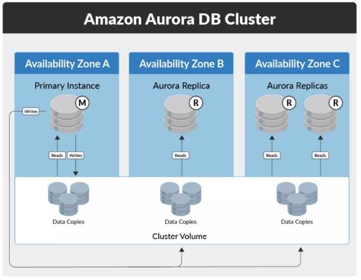

# AWS Developer Associate Certification Learning Path

---

## TOC

<!-- TOC depthFrom:2 depthTo:2 withLinks:1 updateOnSave:1 orderedList:0 -->

- [IAM Identity and Access Management Overview](#iam-identity-and-access-management-overview)
- [Compute Fundamentals](#compute-fundamentals)
- [Database Fundamentals](#database-fundamentals)
- [RDS Multi-AZ and Read Replicas](#rds-multi-az-and-read-replicas)
- [Working with Dynamo DB](#working-with-dynamo-db)
- [Storage Fundamentals](#storage-fundamentals)
- [Optimize S3 Performance](#optimize-s3-performance)
- [S3 Encryption Mechanisms](#s3-encryption-mechanisms)
- [KMS Key Encryption](#kms-key-encryption)
- [Encrypt an EBS Volume](#encrypt-an-ebs-volume)
- [Working with Amazon CloudFront](#working-with-amazon-cloudfront)
- [Intro to Amazon ElastiCache Service](#intro-to-amazon-elasticache-service)
- [Using SQS, SNS and SES in a decoupled and distributed environment](#using-sqs,-sns-and-ses-in-a-decoupled-and-distributed-environment)
- [Serverless Computing](#serverless-computing)
- [AWS Lambda](#aws-lambda)
- [Creating an API Gateway](#creating-an-api-gateway)
- [Serverless Functions](#serverless-functions)
- [Working with Amazon Kenesis](#working-with-amazon-kenesis)
- [Using AWS X-Ray to monitor a Node.js App deployed with Docker Containers](#using aws-x-ray-to-monitor-a-node.js-app-deployed-with-docker-containers)
- [Deployment Orchestration with AWS Elastic Beanstalk](#deployment-orchestration-with-aws-elastic-beanstalk)
- [AWS CloudFormation](#aws-cloudformation)
- [Intro to DevOps](#intro-to-devops)
- [Intro to Continuous Integration CI](#intro-to-continuous-integration-ci)
- [Intro to Continuous Delivery CD](#intro-to-continuous-delivery-cd)
- [AWS CodeCommit](#aws-codecommit)
- [Working with AWS CodeDeploy ](#working-with-aws-codedeploy)
- [Working with AWS CodePipeline ](#working-with-aws-codepipeline)
- [Working with AWS CodeBuild](#working-with-aws-codebuild)
- [Working with AWS Route53](#working-with-aws-route53)

<!-- /TOC -->

---

<br/>

## IAM Identity and Access Management Overview

<br/>

### Intro

This is a key security service within AWS and is likely to be the first security service you will use and come across
allowing you to configure specific access controls within your environment.

**Course Summary**
- *What is Identity & Access Management?*
  - This section will explain what IAM means and why it’s necessary to implement and maintain control of this service.
- *Groups, Users & Roles*
  - This section will define the differences between Groups, Users and Roles and how each of these objects are
  typically used
- *IAM Policies*
  - This section will cover what IAM Policies are, how to create, modify and apply them within your AWS environment
- *Multi-Factor Authentication*
  - This section will explain what MFA is and the best practices
- *Identity Federation*
  - This lecture will explain how external identities (users who do not have IAM user accounts) can access your AWS
  resources through the use of identity providers
- *IAM Features*
  - This lecture will focus on the information contained within IAM Account settings, the credential report and also
  how IAM integrates with KMS

**Course Goals**
- Setup and configure users, groups and roles to control which identities have authorization to access specific AWS
resources
- Implement Multi-Factor Authentication
- Create and implement IAM Policies allowing you to grant or restrict very granular and specific permissions across a
range of resources
- Implement a Password policy to align with your internal security controls
- Understand when and why you may use Identity federation access
- Understand how the Key Management Service (KMS) is used in conjunction with IAM

<br/>

### What is Identity and Access Management

**Identities** are required to authenticate AWS accounts.
- Username: Identity
- Password: Verification

**Access Management** relates to authorization and access control.
- What that user is authorized to access

To manage, control and govern authentication, authorization and access control mechanisms of identities to your
resources within your AWS Account.

**IAM Components**

The IAM service is used to manage and control security permissions

- Users: Objects within IAM identifying different users.
- Groups: Objects that contain multiple users.
- Roles: Objects that different identities can adopt to assume a new set of permissions.
- Policy Permissions: JSON policies that define what resources can and can't be accessed.
- Access Control Mechanisms: Mechanisms that govern how a resource is accessed.

IAM is a global service.

IAM is the first service a user will interact with.

**Importance of IAM**

It is critical to understand IAM and know how to implement its features:
- Without IAM there is no way of maintaining security or controlling the access to you resources.
- IAM provides the components to manage access, but it is only as strong as you configure it.
- The responsibility of implementing secure, robust and tight security within IAM is yours!

**IAM Responsibility**

It is critical to understand IAM and know how to implement its features.

- How secure your access control procedures must be
- How much should you restrict users access
- How complex a password policy must be
- Should you use Multi-Factor Access

The IAM service can be found under the 'Security, Identity & Compliance' section on the AWS console.

<br/>

### Users, Groups and Roles

#### Users

User objects are created to represent an identity:
- A user can represent a real person who requires access to operate and maintain your AWS environment.
- Or it can be an account used by an application that requires permissions to access your AWS resources programmatically.

#### Creating Users

Users can be created via AWS Management Console or programmatically via the AWS CLI, Tools for Windows Powershell, or
using the IAM HTTP API

User creation steps:
1. Username
2. Access Type
  - AWS management Console Access and/or Programmatic access
  - To use the AWS Management Console Access, the user will need to be issued with a password.
  - For programmatic access, an access key ID and secret access key ID will be issued to be used with the AWS CLI
  SDKs or other development tools.
3. Define Password
  - If AWS Management Console was selected in the previous step
4. Permission assignment
  - Attach policies to user or assign user to a group where policies can be inherited from
5. Review and Confirm info
6. Create the User
7. Download security credentials within the csv file
  - These details can be emailed to the new user

#### Access Keys

Access keys are required for programmatic access for authentication.

**Access Key ID**
- 20 random uppercase alphanumeric characters

**Secret Access Key**
- 40 random upper and lowercase alphanumeric and non-alphanumeric characters
- During the creating of a user who requires programmatic access, you are prompted to download and save the details,
as the secret access key ID will only be displayed once, and if you lose it, you will then have to delete the
associated access key ID and recreate new keys for the user.
- It is not possible to retrieve lost Secret Access Key IDs!


- These keys must be applied and associated with you application.
- If you're using the AWS CLI to access a resource, you first have to instruct the AWS CLI to use these Access Keys.
- This association ensures that all API requests are signed with this digital signature.

#### Users

A summary of the object can be viewed by selecting the user, from within the user page of the console. This will show
the user ARN, Amazon Resource Name, which is a unique identifier of the object, the creation time of the user object,
as well as:
- Permissions
  - *Policies*
- *Groups*
- *Security Credentials*
  - password management
  - Manage Multi Factor Authentication
    - Used for admins at minimum
  - Managed signing certificates
  - Create new Access keys for programmatic access
  - Upload SSH public keys for AWS CodeCommit
    - used to authenticate access to AWS CodeCommit repositories
  - generate HTTPS Git credentials for AWS CodeCommit
    - allows you to authenticate HTTPS connections to AWS CodeCommit repositories
- *Access Advisor*
  - Shows a list of services that the user has permissions for, and the last time that those services were used
  with those assigned permissions.
  - This is great to help you refine and revise the user permissions.

**AWS CodeCommit**
- AWS CodeCommit is a managed source control service.
- CodeCommit allows you to host secure and scalable private Git repositories

#### Groups

- IAM Groups are objects like user objects
- Groups are not used in authentication process
- They are used to authorize access through AWS Policies

IAM Groups contain IAM Users and have IAM Policies associated that will allow or deny access to AWS resources. These
policies are either AWS managed policies or customer managed policies.

Groups are typically relate to a specific requirement or job role. Any users that are part of the group inherit the
permissions applied to that group. Applying permissions to groups instead of individual users helps manage multiple
users at once.

**Creating Groups**
 Steps:
 1. Create Group Name
 2. Assign Policies
 3. Review

#### Roles

IAM Roles allow you to adopt a set of temporary IAM permissions.  

Example:
You have an EC2 instance running an application that requires access to Amazon S3 to Put and Get objects using the
relevant API calls
- To allow access to S3, a set of credentials could be stored on the EC2 Instance
- Or, you can assign an IAM Role to the EC2 Instance.  *BEST PRACTICE!*

**Advantages**
- Roles don't have any access keys or credentials associated with them. The credentials are dynamically assigned by AWS.
- You can alter the permissions assigned to the Role and all the EC2 instances associates will have the correct access.

**Roles and Users**

There are circumstances where you need to grant temporary access to a resource for a particular user.
- Allow the user to assume a Role temporarily

**Roles Types**
1. AWS Service Role
  - Used by other services that would assume the role to perform specific functions
  - Amazon EC2, AWS Directory Services, and AWS Lambda
  - Once you have selected your service role, you would then need to attach a policy with the required permissions
2. AWS Service-Linked Role.
  - These are very specific roles that are associated to certain AWS services.
  - They are pre-defined by AWS, and the permissions can't be altered in any way, as they are set to perform a
  specific function.
  - Examples of these AWS Service-Linked Roles are Amazon Lex-Bots, and Amazon Lex-Channels.
  - Once you have selected your service-linked role, you simply need to assign it a name and complete the creation.
    - Remember, these roles do not allow you to modify the permissions assigned.
3. Cross-Account Access
  - This role type offers two options.
  - Providing access between AWS accounts that you own, and providing access between an account that you own and a
  third-party AWS account.
  - Access is managed by policies that establish trusting and trusted accounts that explicitly allow a trusted principal
  to access specific resources. Many services use roles to allow cross-account access to resources.
    - High-level configuration
      - The *trusting account*  has the resources that need to be accessed.
      - The *trusted account* contains the users that need to access the resources in the trusting account.
        - A role is created in the trusting account.
        - A trust is then established with the role by entering the AWS account number
        of the trusted account.
        - Permissions are then applied to the role via policies
        - The users in the trusted account then need to have a policy attached to enable permissions to allow them to
        assume the role in the trusting account.
  4. Identity Provider Access
    - Grant access to web identity providers.
      - Create a trust for users using Amazon Cognito, Amazon, Facebook, Google, or any other open ID connect provider.
    - Grant web single sign on to SAML providers.
      - Allows access for users coming from a SAML (Security Assertion Markup Language) provider
    - Grant API access to SAML providers.
      - Allows access from SAML provider via the AWS CLI, SDKs, or API calls.
    - For these options, a trust relationship is set up between the external identity providers to allow access to
    your AWS account's resources, using their existing identity provider login information.

#### Demonstration
1. Creating a group,
2. Attach permissions to this group
  - using an existing AWS managed IAM policy
3. Create a new user
4. Assign this user to the group
  - as per best practice.
5. Set up a new service role
  - to be associated to an EC2 instance
6. Assign this role to a new EC2 instance

<br/>

### IAM Policies

IAM Policies are used to assign permissions to user, group and role objects.

They are formatted as a JSON document and have at least one statement.

```JSON
{
  "Version": "2012-10-17",
  "Statement": [
    {
      "Sid": "Stmt1494509737040",
      "Action": "cloudtrail:*",
      "Effect": "Allow",
      "Resource": "*",
      "Condition": {
        "IpAddress": {
          "aws:SourceIp": "10.10.0.0/16"
        }
      }
    }
  ]
}
```

**Version:**
- The policy language version

**Statement**
- The main element of the policy, which includes sub elements that identify the level of access, granted or denied
and to which resource:
  - Sid
    - Sid, Statement ID, is a unique identifier within the Statement array.
    - As more permissions are added, the Statement will have more Sids.
  - Action
    - What will either be allowed or denied.
    - Effectively API calls for different services.
    - Different Actions are used for each service.
      - For example, for `DeleteBucket` action is available for *S3*, but not for *EC2*.
      - And likewise, the `CreateKeyPair` action is available for *EC2* but not *S3*. The Action is prefixed with the
      associated AWS service.
      - We could have two Actions for cloudtrail `"Action: [ "cloudtrail:CreateTrail", "cloudtrail:DeleteTrail" ]`
      - Or, as seen below, use an asterisk as a wild card which represents all *Actions* for the cloudtrail service, essentially granting full access to the service.
  - Effect
    - Can be set to `Allow` or `Deny`
    - Will grant or restrict access to all *Actions* in the same *Statement*.
    - Set to `Deny` by default.
  - Resource
    - Element specifies the actual resource you wish the *Action* and *Effect* to be applied to.
    - AWS uses ARNs to specify resources following the syntax:
      `<arn>:<partition>:<service>:<region>:account-<id>:<resource>`
      - `partition`
        - Relates to the partition that the resource is found in.
        - For standard AWS regions, this section would be `aws`.
      - `service`
        - Reflects the specific AWS service. For example, *s3* or *ec2*.
      - `region`
        - The region that the resource is located.
        - Some services do not need the region specified, so this can sometimes be left blank.
      - `account-id`
        - Your AWS account Id, without hyphens.
        - Some services do not need this information, and so it can be left blank.
      - `resource`
        - The value of this field will depend on the AWS service you are using.
        - If using the Action `s3:PutObject`, then the bucket name could be used, applying stated permission to only that bucket.
  - Condition
    - An optional element that allows control of when the permission will be effective.
    - Consists of a condition and a key-value pair.
    - Below
      - "IpAddress" is the condition
      - "aws:SourceIp" is the key
      - "10.10.0.0/16" is the value
      - Effectively, what this is saying is if the Source IP address of the user who is using the policy is within
      their 10. 10. 0. 0/16 network range, then allow the permissions to be used.


**Multiple Sids**

There can be multiple Sids within a Statement, each granting different levels of access:

- The first Sid allows any resource full access to "cloudtrail" as long as their Source IP address is within the
10.10.0.0/16 range.
- The second Sid allows any resource to have full access to "autoscaling".
- The third Sid allows the creation and deletion of s3 buckets within the "iam-course-ca" bucket on s3.

```JSON
{
  "Version": "2012-10-17",
  "Statement": [
    {
      "Sid": "Stmt1494509737040",
      "Action": "cloudtrail:*",
      "Effect": "Allow",
      "Resource": "*",
      "Condition": {
        "IpAddress": {
          "aws:SourceIp": "10.10.0.0/16"
        }
      }
    },
    {
      "Sid": "Stmt1494512658702",
      "Action": "autoscaling:*",
      "Effect": "Allow",
      "Resource": "*",
    },
    {
      "Sid": "Stmt1494515449405",
      "Action": [
        "s3:CreateBucket",
        "s3:DeleteBucket"
        ],
      "Effect": "Allow",
      "Resource": "arn:aws:s3:::iam-course-ca",
    }
  ]
}
```

[**IAM Policy Element Reference**](http://docs.aws.amazon.com/IAM/latest/UserGuide/reference_policies_elements.html)


#### IAM Policy Types

1. Managed Policies
2. customer Managed Policies

**Managed Policies**

These policies can be associated with Groups, Roles or Users.

*AWS Managed Policies*
- Preconfigured by AWS
- Covers most common permissions
  - Ex:
    - *AmazonS3FullAccess*: Provides full access to all buckets via AWS Management Console
    - *AmazonS3ReadOnlyAccess*: Provides read only access to all buckets via the AWS Management Console.

*AmazonS3FullAccess*

```JSON
{
  "Version": "2012-10-17",
  "Statement": [
    {
      "Effect": "Allow",
      "Action": "s3:*",
      "Resource": "*"
    }
  ]
}
```

*AmazonS3ReadOnlyAccess*

```JSON
{
  "Version": "2012-10-17",
  "Statement": [
    {
      "Effect": "Allow",
      "Action": [
        "s3:Get*",
        "s3:List"
      ],
      "Resource": "*"
    }
  ]
}
```

**Customer Managed Policies**
- Configured by the user.
- You can start with an AWS Managed Policy.  With tweaks it becomes a Customer Managed Policy.

Example:  A user requires read only access to everything on *S3*, plus the ability to create new buckets. To create
the appropriate policy for this user, we should consider using the *AmazonS3ReadOnlyAccess* AWS Managed policy, which
would give us the Read Only permission, but it would need to be copied and altered to allow the creation of buckets too.

*AmazonS3ReadOnlyAccess with CreateBucket Permission*

```JSON
{
  "Version": "2012-10-17",
  "Statement": [
    {
      "Effect": "Allow",
      "Action": [
        "s3:Get*",
        "s3:List",
        "s3:CreateBucket"
      ],
      "Resource": "*"
    }
  ]
}
```

#### Creating a Customer Managed policy

1. Copy any AWS Managed Policy
  - An existing AWS Managed Policy is copied and edited to create a new policy
2. Policy Generator
  - Create a policy by selecting options from dropdown boxes.
3. Create Your Own Policy
  - Write policies from scratch or paste JSON policy from another source.

*Note*: Use the `Validate Policy` button to check syntax


#### Inline Policies

Inline Policies are directly embedded into a specific User, Group or Role--therefore cannot be reapplied.

- Inline Policies are created and attached directly to you IAM object.
- They do not how up under Policies list as they are not publicly available for other identities.
- Typically used when you don't want to risk the permissions being applied to another identity.

To add an Inline Policy you must select the Use, group or Role and under Permissions click the option.
There are two options: the Policy Generator and Custom Policy.

If there are conflicting permissions:
1. By default, all access is denied
2. Access will only be allowed if an explicit "Allow" has been specified.
3. A single "Deny" will overrule and "Allow"
  - An explicit "Deny" will always take precedence over an explicit "Allow".

<br/>

### Multifactor Authentication

**Multifactor Authentication (MFA)**

Typically when a user logs into the AWS management console that will authenticate to your AWS account by providing
their identification, typically their user name and then verify this identification usually with a password.

These two elements, identification and verification, allow the user to authenticate.

- Username -> Identification
- Verification -> Verification

For users who have a high level of authorization an additional verification step within the authentication process can
be added.

**MFA** is used to create an additional factor for authentication.

**MFA** uses a random 6 digit number generated by an MFA device.
  - No additional charge for MFA
  - You need your own MFA device
  - It can be a physical device or a virtual token
    - Instructor used Google Authenticator

[All Supported Devices](https://aws.amazon.com/iam/details/mfa/)

- The MFA device must be configured and associate to the user
- This configuration can be done from within IAM in the Management Console

Sometimes you can use MFA to increase security when making API calls to other resources.

<br/>

### Identity Federation

Identity federation allows you to access and manage AWS resources even if you don't have a user account within IAM.

- Identity providers (IdP) allow users to access AWS resources securely.
  - An example of an identity provider is Microsoft Active Directory (MS-AD)
- Other forms of IdP can be any OpenID Connect (OIDC) web provider
  - Common examples: Google, Amazon, Facebook
  - [OIDC](http://openid.net/connect/)
- Using MS-AD is an effective way of granting access to your AWS resources

If users need access to AWS resources that already have identities that could be used as an identity provider, then
you could allow access to your environment using these existing accounts instead of setting each of them up a new
identity within AWS IAM.

*Benefits:*
- Minimizes the amount of administration required within IAM
- Allows for a Dingle Sign-On (SSO) solution

*Two Types of IdP:*
- OpenID
  - Allows authentication between AWS resources and any public OpenID Connect provider such as Facebook, Google,
  Amazon)
  - When an access request is made, the user IdP credential will be used to exchange an authentication token for
  temporary authentication credentials.
  - These temporary credentials with pre-configured permissions allow authorized access to resource as required.
  - The process would be managed most effectively with [Amazon Cognito](https://aws.amazon.com/cognito/) which helps manage user sign-in to mobile and
  web apps through federated access.
- SAML
  - Security Assertion Markup Language
  - Allows your existing MS-AD users to authenticate to your AWS resources on a SSO approach
  - SAML lets the exchange of security data, including authentication and authorization tokens to take place between
    an IdP and a service provider.
    - In this case the IdP is MS-AD and the service provider is AWS

**Active Directory Authentication**

A user within an organization requires API access to S3, EC2 and RDS.

Security Token Service, [STS](http://docs.aws.amazon.com/STS/latest/APIReference/Welcome), allows you to gain temporary
security credentials for federated users via IAM.

How federation is instigated from the user for API access to specific AWS services:
1. The user initiates a request to authenticate against the ADFS Server via a web browser using a SSO URL.
2. If their authentication is successful by the AD credentials, SAML issues an assertion back to the users client
   requesting federated access.
3. The SAML assertion is sent to the AWS STS to assume a role within IAM using the
   [*AssumeRoleWithSAML API*](http://docs.aws.amazon.com/IAM/latest/UserGuide/id_credentials_temp_control-access_assumerole.html)
4. STS response to the user requesting federated access with temporary security credentials with an assumed role and
   associated permission.
5. The user has federated access to the necessary AWS services.


Corporate identity federation is always authenticated internally first by Active Directory before AWS.

**Creating an Identity Provider**

Creating an IdP is a simple process. the required information is as follows:
- OpenID
  - A client ID (audience) that you receive once you register your app with your IdP.
  - A Thumbprint to verify the certificate of your IdP.
- SAML
  - A SAML Metadata document that you get by using the identity management software from your IdP.
  - This document includes information such as the issuer's name, expiration data and security keys.
- [Further Requirements](http://docs.aws.amazon.com/IAM/latest/UserGuide/iam-ug.pdf)

**Creating an OIDC Identity Provider**

To create an IdP for OIDC:
1. From the IAM console, Select 'Identity Providers'
2. Click 'Create Provider'
3. Select 'OpenID Connect'
4. Enter the URL of the IdP
5. Enter the Client ID of your application
6. Supply the Thumbprint for certificate verification
7. Create a Role for the Identity Provider
8. Verify the information and click 'Create'
9. The OIDC Provider will then be created

**Creating A SAML Identity Provider**

To create a SAML provider:
1. From within the IAM Console Select 'Identity Providers'
2. Click 'Create Provider'
3. Select 'SAML'
4. Enter a name for the Identity Provider
5. Point to the SAML metadata document
6. Verify the information and click 'Create'

<br/>

### Features of IAM

**Account Settings**

Can be found in the menu bar in the IAM console.

Account Settings contain information related to your IAM Password policy and Security Token Serve regions.
- The Password policy is used and adopted by your IAM Users.
- There are many components that can be changed within the password policy to align to any required security standards.

The second element of Account Settings are Security Token Service Regions

**Credential Report**

Accessed by selecting 'Credential Report' on the menu bar of the IAM console and click 'Download Report'.
- It will generate a csv file containing a list of all your IAM users and credentials.
- Report can only be generated once every four hours

**Key Management Service (KMS)**

The KMS enables you to easily manage encryption keys to secure your data.
- You can control how the keys can be used to encrypt your data.
- If you lose or delete your keys, they cannot be recovered!
- You can manage your KMS Custom Master Keys (CMK) form within the IAM console.

To administer your CML, select 'Encryption Keys' within the side menu bar of the IAM console.

---

<br/><br/>

## Compute Fundamentals

**Topics:**
- EC2 - Elastic Cloud Compute
- ECS - Elastic Container Service
- ECR - Elastic Container Registry
- EKR - Elastic Container Service of Kubernetes
- AWS Elastic Beanstalk
- AWS Lambda
- AWS Batch-CF
- Amazon Lightsail

**What Is Compute?**

Compute resources can be considered the brains and processing power required by applications and systems to carry out
computational tasks via a series of instructions.

Compute is closely related to common server components such as CPU and RAM.

A physical server within a data center would be considered a Compute resource as it may have multiple CPU's and many
GBs of RAM.

**Compute in AWS**

Within AWS, there are a number of different services and features that offer Compute power to provide different
functions.

Compute Services can comprise of many EC2 instances (virtual servers) which man be used continuously processing a
series of instructions.

To utilize a few hundred milliseconds of compute resources to execute just a few lines of code with AWS Lambda.

Compute resources can be consumed in different quantities, for different lengths of time, across a range of categories,
offering a wide scope of performance and benefit options.

[AWS Could Compute Index](https://aws.amazon.com/products/compute/)

<br/>

### EC2 - Elastic Cloud Compute

EC2 allows you to deploy virtual servers within your AWS environment. Most people will require an EC2 instance within
their environment as a part of at lest on of their solutions.

EC2 components:
  - Amazon Machine Images (AMIs)
  - Instance Types
  - Instance Purchasing Options
  - Tenancy
  - User Data
  - Storage Options
  - Security

#### Amazon Machine Images (AMIs)

AMIs are essentially templates of pre-configured EC2 instances which allow you to quickly launch a new EC2 instance
based on the configuration within the AMI.

An AMI is an image baseline that will include an operating system and applications along with any custom configuration.

AWS provides a large number of AMIs covering different operating systems such as Linux, Red Hat, Microsoft Windows, etc.

When launching an EC2 instance, selecting an AMI is the first configuration made.

**Custom AMIs** can be created to speed up deployments. Starting with selecting an AWS AMI then installing a number of
your own custom applications and making specific configuration changes. This AMI and its configurations can be saved, as a
brand new AMI or template, so the manual process will not need to be repeated.

The **AWS Marketplace** is essentially an online store that allows you to purchase AMIs from trusted vendors.

**Community AMIs** are a repository of AMIs that have been created and shared by other AWS members.

**Instance Types**

Once you have selected your AMI from any of the different sources already discussed, you must then select an instance
type.

An instance type defines the size of the instance based on parameters (*key parameters*):
- ECUs
  - Number of EC2 compute units for instance
- *vCPUs*
  - Number of virtual CPUs on the instance
- Physical Processor
  - Process speed used on the instance
- Clock Speed (GHz)
  - Clock speed in gigahertz
- *Memory (GB)*
  - Amount of memory associated with the instance
- *Instance Storage (GB)*
  - Capacity of the local instance store volumes available
- EBS - Optimized Available
  - Defines if the instance supports EBS optimized storage or not
- *Network Performance*
  - Performance level of rate of data transfer
- IPv6 Support
  - Indicates if the instance type supports IPV6
- Processor Architecture
  - The architected type of the processor
- AES-NI
  - Advanced Encryption Standard New Instructions
  - Shows if the instance supports it for enhanced data protection
- AVX
  - Advanced Vector Extensions
  - Indicates if the instance supports AVX
  - Primary used for applications focused on audio and video, scientific calculations and 3D modeling analysis
- Turbo
  - Shows if the instance supports intel turbo boost and AMD turbo core technologies

<br/>

**Instance Family Types**

These different instance types are categorized into different family types that offer distinct performance benefits.

*Micro instances*
These instances are low cost due to the minimal amount of CPU and memory power. These are ideal for very low throughput
use cases such as low traffic websites.

*General-purpose*
Balanced mix of CPU memory and storage making them ideal for small to medium databases, tests and development
servers and back-end servers.

*Compute optimized*,
Focus on compute power. They have the highest performing processors installed allowing them to be used for high-
performance front end servers; web servers; science and engineering applications; video encoding and batch processing.

*GPU instances*
Optimized for graphic intensive applications.

*FPGA instances*
Allows customization of Field Programmable Gate Arrays. To create application specific hardware accelerations when
used with applications that use massively parallel processing power such as genomics and financial computing.

*Memory optimized*
Primarily used for large-scale enterprise class in-memory applications, such as performing real time processing of
unstructured data. They are also ideal for enterprise applications such as Microsoft SharePoint. These instances of
the lowest cost per gigabyte of RAM against all other instance families.

*Storage optimized*
Optimized for enhanced storage. Instances in this family use SSD backed instant storage for low latency and very high
I/O, input/output performance, including very high IOPS--input/output operations per second. These are great
for analytic workloads and no SQL databases. Data file systems and log processing applications.

<br/>

**Instance Purchasing Options**

- *On-demand Instances*
  - Can be launched at any time
  - Can be used for as long as needed
  - Flat rate determined on the instance type
  - Typically used for short-term
  - Best fit for development and testing environments
- *Reserved Instances*
  - Purchases for a set period of time for reduced cost
  - All Upfront:
    - Complete payment for 1 or 3 year time frame
  - Partial Upfront:
    - Smaller upfront payment for smaller discount
  - No Upfront:
    - Smallest discount
- *Scheduled Instances*
  - You pay for the reservations on a recurring schedule, either daily, weekly or monthly
  - You could set up a scheduled instance to run during that set time frame one a week
  - Note the even if you don't use the instance you are still charged.  
- *Spot Instances*
  - Bid for an unused EC2 Compute Resource
  - No guarantees for a fixed period of time
  - Fluctuation of prices based on supply and demand
  - Purchase large EC2 instances at very low price
  - Useful for processing data that can be suddenly interrupted
- *On-demand Capacity Reservations*
  - Reserve capacity based on different attributes such as instance type, platform and tenancy, within a
    particular availability zone for a period of time
  - It could be used in conjunction with your reserve instances discount

<br/>

**Tenancy**

This relates to what underlying host your EC2 instance will reside on, which is essentially the physical
server within an AWS Data Center.

*Shared Tenancy*
- EC2 instance is launched on any available host with the required resources
- The same host may be used by multiple customers
- AWS Security mechanisms prevent one EC2 instance accessing another in the same host

*Dedicated Instances*
- Hosted on hardware that no other customer can access
- May be required to meet compliance
- Dedicated instances incur additional charges

*Dedicated Hosts*
- Additional visibility and control on the physical host
- Allows to use the same host for a number of instances
- May be required to meet compliance

**User Data**

User Data allows you to enter commands to run during the first boot cycle of an instance

- Perform functions upon boot such as pulling down and additional software to install
- Download latest OS update

**Storage Options**

Selecting storage for your EC2 instance will depend on the instance selected, what you intend to use the instance for
and how critical the data is.

*Persistent Storage* - Available by attaching EBS volumes
- EBS volumes are separated from the EC2 instance
- These volumes are logically attached via AWS network
- You can disconnect the volume form the EC2 instance maintaining data
- You can implement encryption and take backup snapshots of all the data

*Ephemeral Storage* - Created by EC2 instances using local storage
- Physically attached to the underlying host
- When the instance is stopped or terminated, all saved data on disk in lost
- If you reboot, your data **will** remain intact
- You are unable to detach instance store volumes from an instance

<br/>

**Security**

[Cloud Academy Instance Level Security Blog](http://cloudacademy.com/blog/aws-security-groups-instance-level-security/)

*Security Groups*

During the creation of an EC2 instance you will be asked to select a Security Group for you instance.

- A security group is essentially an instance level firewall allowing you to restrict both ingress and egress traffic
  by specifying what traffic is allowed to communicate with it. You can restrict this communication by source ports
  and protocols for both inbound and outbound communication.

*Key Pairs*

At the end of your EC2 instance creation, you will need to select an existing Key Pair or create and download a new one.

- A *Key Pair* is made up of a *Public Key* and a *Private Key*.
- The function of Key Pairs is to encrypt the login information for Linux and Windows EC2 instances, and the decrypt
  the same information allowing you to authenticate onto the instance.
- The *Public Key* is used to encrypt the username and password
- For Windows instances, the *Private Key* decrypts this data allowing you to gain access to the login credentials.
- For Linux instances, the *Private Key* is used to remotely connect onto the instance via SSH.
- The *Public Key* is held and kept by AWS and the *Private Key* is your responsibility.
- It is possible to use the same *Key Pair* on multiple instances.
- You can set up additional less-privileged access controls, such as local Windows accounts.  

*Note*: It is your responsibility to maintain and install the latest OS and security patches released by the OS vendor
as dictated within the [AWS Shared responsibility Model](https://cloudacademy.com/blog/aws-shared-responsibility-model-security/)

**Setting up an EC2 Instance**

Sections:
1. Choose AMI
2. Choose Instance Type
3. Configure Instance
  - Instance purchasing option, VPC, Public IP Address, assign roles, shutdown behavior, termination protection,
    enable CloudWatch monitoring, tenancy
4. Add Storage
   - Connect EBS Volumes
5. Add Tags
   - Add a key value pair tag to this instance that make it more usable to you
6. Configure Security Group
   - Assign security groups and create or use existing key pairs
7. Review

**Status Checks**

Status checks are used to check the health and status of your EC2 instance and understanding what kind of faults could
trigger these checks to fail.

*System Status Check*
- If a System Status Check fails then it is likely to be an issue with the underlying host rather than a configuration
  issue with your EC2 instance.
- Common issues that trigger system status checks to fail are loss of power, loss of network connectivity and hardware
  and software issues on the underlying host.
- Basically a system status check failure is out of our control and is AWS's fault.
- The best way to resolve this will be to stop the instance and restart--likely launching the instance on another
  physical host resolving the problem. Do not reboot the instance as this will cause the instance to continue running
  on the same physical server.

*Instance Status Checks*
- If a Instance Status Check fails it would likely require your input to help them resolve the issue.
- This check looks at the EC2 instance itself, rather than focusing on the underlying hosts.
- Common issues that trigger this checks to fail are incorrect network configuration, corrupted file systems,
  exhausted memory or incompatible kernel.
- These faults will require you to troubleshoot and resolve the issue, for example changing the network configuration.

<br/>

### ECS - Elastic Container Service

This service **allows you to run Docker-enabled applications packaged as containers across a cluster of EC2 instances**
without requiring you to manage a complex and administratively heavy cluster management system.

The burden of managing your own cluster management system is abstracted with the Amazon ECS service by passing that
responsibility over to AWS, specifically though the use of AWS Fargate.

With Amazon ECS there is no need to install any management or monitoring software for your cluster.

**AWS Fargate** is an engine used to enable ECS to run containers without having to manage and provision instances
and clusters for containers.

**Docker** is piece of software that allows you to automate the installation and distribution of applications inside
Linux Containers.

**Containers** hold everything that an application requires to enable it to run from within it's isolated container
package. This may include system libraries, code, system tools, run time, etc. but it does not include an operating
system like a virtual machine does, and so reduces overhead of the actual container itself.

- Containers are decoupled from the operating system, making Container applications very portable.
- Container applications very portable, lightweight, flexible, and scalable across a cloud environment.
- They ensure that the application will always run as expected regardless of it's deployment location.


**Launching an ECS Cluster**

*Fargate Launch*
- Requires far less configuration and simply requires you to specify the CPU and memory required, define the networking
  and IAM policies in addition to you having to package your applications into containers.

*EC2 Launch*
  - Much more customization and configurable parameters available. You are responsible for patching and scaling your
    instances, and specifying which instance types to use, and how many containers should be in a cluster.

**Monitoring Containers**
- Monitoring is taken care of by Amazon CloudWatch
- You can easily create alarms based on these metrics, providing you notifications when specific events occur
    - Such as your cluster size scaling up or down

**Amazon ECS Cluster**

- An Amazon ECS cluster is comprised of a collection of EC2 instances.
- Features such as Security Groups, Elastic Load Balancing and Auto Scaling can be used with these instances.
- These instances still operate in much the same way as a single EC2 instance.
- Clusters act as a resource pool, aggregating resources such as CPU and memory.
- Clusters are dynamically scalable and multiple instances can be used.
- Clusters can only scale in a single region.
- Containers can be scheduled to be deployed across your cluster.
- Instances within the cluster also have a Docker daemon and an ECS agent.

<br/>

### ECR - Elastic Container Registry

ECR provides a secure location to store and manage your docker images.

This is a fully managed service, so you don't need to provision any infrastructure to allow you to create this registry
of docker images.

This service allows developers to push, pull and manage their library of docker images in a central and secure location.

**Components**

*Registry*

The ECR registry is the object that allows you to host and store your docker images, as well as create image
repositories.

Default registry URL: `https://<aws_account>.dkr.ecr.<region>.amazonaws.com`

- Your account will have both read and write access by default to any images you create within the registry and any
  repositories.
- Access to your registry and images can be controlled via IAM Policies in addition to repository policies.
- Before your docker client can access your registry, it needs to be authenticated as an AWS user via an Authorization
  token.

*Authorization Token*

To begin the authorization process to communicate your docker client with your default registry, you can run the
`get-login` command using the AWS CLI.

`aws ecr get-login --region <region> --no-include-email`

This will produce an output response which will be a docker login command.

`docker login -u AWS -p <password> https://<aws_account_id>.dkr.ecr.<region>.amazonaws.com`

You must then copy this command and paste it into your docker terminal which will then authenticate your client and
associate a docker client to your registry.

This process produces an authorization token that can be used within the registry for 12 hours.

*Repository*

Objects within your registry that allow you to group together and secure different docker images.

You can create multiple repositories with the registry, allowing you to organize and manage your docker images into
different categories.

Using policies from both IAM and repository policies, you can assign permissions to each repository allowing specific
users to perform certain actions, such as performing a push or pull API.

*Repository Policy*

There are a number of different IAM managed policies to help you control access to ECR:
- AmazonEC2ContainerRegistryFullAccess
- AmazonEC2ContainerRegistryPowerUser
- AmazonEC2ContainerRegistryReadOnly

Repository policies are resource-based policies
- You need to ensure you add a principle to the policy to determine who has access and what permissions they have.
- For an AWS user to gain access to the registry, they will require access to the `ecr:GetAuthorizationToken` API call.
- Once they have this access, repository policies can control what actions those users can perform on each of the repositories.
- These resource-based policies are created within ECR itself and within each other repositories that you have

*Image*

Once you have configured your registry, repositories and security controls and authenticated your docker client with
ECR, you can then begin storing your docker images in the required repositories.

To push an image into ER, you can use the docker push command, and to retrieve an image you can use the docker
pull command.

[Docker Push](https://docs.aws.amazon.com/AmazonECR/latest/userguide/docker-push-ecr-image.html)

[Docker Pull](https://docs.aws.amazon.com/AmazonECR/latest/userguide/docker-pull-ecr-image.html)

<br/>

### EKR - Elastic Container Service of Kubernetes

**Kubernetes** is an open-source **container orchestration tool** designed to automate, deploying, scaling, and
operating containerized applications. It is designed to grow from tens, thousands, or even millions of containers.
Kubernetes is also container-runtime agnostic, which means you can use Kubernetes to run rocket and docker containers.

**EKS** is a managed service allowing you to **run Kubernetes across your AWS infrastructure** without having to take
care of provisioning and running the Kubernetes management infrastructure in what's referred to as the **control
plane**.

You, the AWS account owner, only need to provision and maintain the **worker nodes**.

#### Kubernetes Control Plane:

There are a number of different components that make up the Control Plane and these include **a number of different
APIs, the kubelet processes and the Kubernetes Master**, these dictate how Kubernetes and your clusters communicate
with each other.  The control plane itself is run across master nodes.

The Control Plane **schedules containers onto nodes**.

*Note:* The term *scheduling* does not refer to time in this context, however, refers to the decision process of
placing containers onto nodes in accordance with their declared, compute requirements.  

The Control Plane also tracks the state of all Kubernetes objects by continually monitoring the objects.  

In EKS, AWS is responsible for provisioning, scaling and managing the control plane and they do this by utilizing
multiple availability zones for additional resilience.

#### Worker Nodes

**Kubernetes clusters are composed of nodes** and the term cluster refers to the aggregate of all of the nodes.  

- A node is a worker machine in Kubernetes and runs as an on-demand EC2 instance and includes software to run containers managed by the Kubernetes control plane.  
- For each node created, a specific AMI is used which also ensures docker and kubelet in addition to the AWS IAM authenticator is installed for security controls.
  - These nodes are what us as the customer are responsible for managing within EKS.  
- Once the worker nodes are provisioned they can then connect to EKS using an endpoint.

#### Working with EKS

1. **Create an EKS Service Role**:
  - Before you begin working with EKS you need to configure and create am IAM service-role that allows EKS to
   provision and configure specific resources.  
  - This role only needs to be created once and can be used for all other EKS clusters created going forward.
  - The role needs to have the following permissions policies attached to the role:
    - `AmazonEKSServicePolicy` and `AmazonEKSClusterPolicy`

2. **Create an EKS Cluster VPC**:
  - Using AWS CloudFormation you need to create a and run a CloudFormation stack based on the following
   [template](https://amazon-eks.s3-us-west-2.amazonaws.com/cloudformation/2019-02-11/amazon-eks-vpc-sample.yaml)
   which will configure a new VPC for you to use with EKS.

3. **Install kubectl and the AWS-IAM-Authenticator**:
  - Kubectl is a command line utility for Kubernetes and can be installed following the details supplied [here](https://docs.aws.amazon.com/eks/latest/userguide/install-kubectl.html)
  - The IAM-Authenticator is required to authenticate with the EKS cluster.  Depending on your client OS (Linux, MacOS
    or Windows) it can be downloaded from [here](https://docs.aws.amazon.com/eks/latest/userguide/install-aws-iam-authenticator.html)

4. **Create your EKS Cluster**:
  - Using the EKS console you can now create your EKS cluster using the details and information from the VPC created in step 1 and 2

5. **Configure kubectl for EKS**:
  - Using the `update-kubeconfig` command via the AWS CLI you need to create a kubeconfig file for your EKS cluster

6. **Provision and configure Worker Nodes**:
  - Once your EKS cluster shows an ‘Active’ status you can launch your worker nodes using CloudFormation based on the
    [template](https://amazon-eks.s3-us-west-2.amazonaws.com/cloudformation/2019-02-11/amazon-eks-nodegroup.yaml)

7. **Configure the Worker Node to join the EKS Cluster**:
  - Using a configuration map downloaded here:
`curl -O https://amazon-eks.s3-us-west-2.amazonaws.com/cloudformation/2019-02-11/aws-auth-cm.yaml`
  - You must edit it and Replace the <ARN of instance role (not instance profile)> with the *NodeInstanceRole* value
    from step 6.

<br/>

### AWS Elastic Beanstalk

AWS Elastic Beanstalk is an AWS managed service that takes uploaded code of your web application, along with the
environment configurations, and automatically provisions and deploys the required resources within AWS to make the
web application operational.

These resources can include EC2, Auto Scaling, application health-monitoring, and Elastic Load Balancing, in addition
to capacity provisioning.

This automation and simplification makes it an ideal service for engineers who may not have the familiarity or the
necessary skills within AWS to deploy, provision, monitor, and scale the correct environment themselves to run the
developed applications.

This responsibility is passed on to AWS Elastic Beanstalk to deploy the correct infrastructure to run the uploaded
code.

You can continue to support and maintain the environment as you would with a custom built environment.

You can perform some of the maintenance tasks from the Elastic Beanstalk dashboard itself.

Elastic Beanstalk is able to operate with a variety of different platforms and programming languages.
Currently EBS is compatible with:
  - Packer Builder
  - Single Container Docker
  - Multi-container Docker
  - Preconfigured Docker
  - Go
  - Java SE
  - Java with Tomcat.NET on Windows Server with IIS
  - Node.js
  - PHP Python
  - Ruby

*Note*: EBS itself is free to use, however, you will be charged for any resources that are created on your
application's behalf, such as EC2 instances.

<br/>

#### Elastic Beanstalk Core Components

**Application Version**

An application version is a very specific reference to a section of deployable code. The application version will
point typically to S3, simple storage service to where the deployable code may reside.

**Environment**

An application version that has been deployed on AWS resources, which are configured and provisioned by EBS.

At this stage, the application is deployed as a solution and becomes operational within your environment.

The environment is comprised of all the resources created by Elastic Beanstalk and not just an EC2 instance with your
uploaded code.

**Environment Configurations**

A collection of parameters and settings that dictate how an environment will have its resources provisioned by EBS and
how these resources will behave.

**Environment Tier**

This component reflects on how Elastic Beanstalk provisions resources based on what the application is designed to do.

- If the application manages and handles HTTP requests, then the app will be run in a *web server environment*.
- If the application does not process HTTP requests, and instead perhaps pulls data from an SQS queue, then it would
  run in a *worker environment*.

**Configuration Template**

This is the template that provides the baseline for creating a new, unique environment configuration.

**Platform**

A culmination of components in which you can build your application upon using Elastic Beanstalk.

- OS of the instance
- Programming language
- Server type (web or application)
- Components of EBS itself

**Applications**

An application is a collection of different elements, such as environments, environment configurations, and
application versions.

You can have multiple application versions held within a single application.

You can deploy your application across one of two different environment tiers, either the *web server tier* or the
*worker tier*.

*Web server environment*
- Used for standard web applications that operate and serve requests over HTTP port 80.
  - Typically uses: Route 53, Elastic Load Balancing, Auto Scaling, EC2, and Security Groups.

*Worker environment*
  - Used by applications that will have a back-end processing task that will interact with AWS SQS, the Simple Queue Service.
    - Typically uses: SQS Queue, an IAM Service Role, Auto Scaling, and EC2.

<br/>

#### Elastic Beanstalk Workflow

1. Create Application
2. Upload Version
   - Along with additional configuration information. This creates the environment configuration.
3. Launch Environment
4. Manage Environment
   - If the management of your applications alters the environment configuration, then your environment will
     automatically be updated to reflect the new code should additional resources be required.

<br/>

### AWS Lambda

AWS Lambda is a **serverless compute service** which has been designed to allow you to run your application code
without having to manage and provision your own EC2 instances.

Serverless means that you do not need to worry about provisioning and managing your own compute resource to run your
own code, instead this is managed and provisioned by AWS.

Although it's named serverless, it does require servers, or at least compute power, to carry out your code
requests, but because the AWS user does not need to be concerned with what's managing this compute power, or where
it's provisioned from, it's considered serverless from the user perspective.

- If you don't have to spend time operating, managing, patching, and securing an EC2 instance, then you have more time
to focus on the code of your application and its business logic, while at the same time, optimizing costs.

Only pay for the compute power when Lambda is in use via Lambda functions.

AWS Lambda charges compute power per 100ms of use only when your code is running, in addition to the number of times
your code runs.

- With sub-second metering, AWS Lambda offers a truly cost optimized solution for your serverless environment.

**AWS Lambda** is that it is a highly scalable serverless service, coupled with fantastic cost optimization compared
to EC2 as you are only charged for Compute power while the code is running and for the number of functions called.

#### Working with AWS Lambda

There are essentially four steps to it soperation:

1. Upload your code to Lamdba, or write it within the code editor that Lambda provides.
  - Currently supported languages: Node.js, JavaScript, Python, Java, C#, .NET Core, Go and Ruby.
  - Code can also include other libraries.
2. Configure Lambda functions to execute your code upon specific triggers from supported event sources
  - Such as S3.
  - As an example, a Lambda function can be triggered when an S3 event occurs, such as an object being uploaded to an
    S3 bucket.
3. Once the specific trigger is initiated, AWS Lambda will run your code, as per your Lambda function, using only the
   required compute power as defined.
4. AWS records the compute time in milliseconds and the quantity of Lambda functions run to calculate the cost.

#### Components of AWS Lambda

**Lambda Function** - The Lambda function is compiled of your own code that you want Lambda to invoke as per defined
triggers.

**Event Source** - Event sources are AWS services that can be used to trigger your lambda function.

**Trigger** - A Trigger is essentially an operations from an event source that causes the function to invoke.

**Downstream Resource** - Downstream resources are resources that are required during the execution of your Lambda
Function.

**Log Streams** - Log Streams help to identify issues and troubleshoot issues with your lambda function.  These log
streams would essentially be a sequence of events that all come from the same function and recorded in CLoudWatch.

<br/>

#### Creating Lambda Functions

At a high level, the configuration steps for creating a Lambda Function via the Management Console could consist of:

1. Select a Blueprint
   - Select a blueprint template provided by AWS Lambda
   - Ex: `S3-get-object` - an S3 trigger that retrieves metadata
2. Configure Triggers
   - Define a trigger for your Lambda function
   - Ex: Specifying the S3 bucket for your function
3. Configure Function
   - Upload code or edit it in-line
   - Define the required resources, maximum execution timeout, IAM Role and Handler Name.

<br/>

### AWS Batch

**AWS Batch** used to manage and run Batch computing workloads within AWS.

**Batch computing** is primarily used in specialist use cases which require a vast amount of compute power across a
cluster of compute resources to complete batch processing executing a series of jobs or tasks.

You can seamlessly create a cluster of compute resources which is highly scalable, taking advantage of the elasticity
of AWS, coping with any level of batch processing while optimizing the distribution of the workloads.

All provisioning, monitoring, maintenance and management of the clusters themselves is taken care of by AWS.

If you have a requirement to run multiple jobs in parallel using Batch computing, for example, to analyze financial
risk models, perform media transcoding or engineering simulations, then AWS Batch would be a perfect solution.

#### AWS Batch Components

**Jobs**

A Job is classed as a unit of work that is to be run by AWS Batch.
- A Job can be a Linux executable file, an application within an ECS cluster or a shell script.
- Jobs run on EC2 instances as a containerized application.
- Job can be in different states, such as: submitted, pending, running, failed, etc.

**Job definitions**

These define specific parameters for the jobs themselves and dictate how the job will run and with what configuration.

Some examples of these may be:
- How many vCPUs to use for the container
- Which data volume should be used
- Which IAM role should be used
    - Allowing access for AWS Batch to communicate with other AWS services
- Mount points

**Job queues**

Jobs that are scheduled are placed into a Job Queue until they run.

- It's possible to have multiple queues with different priorities
  - One queue could be used for on-demand ECT2 instances, and another queue could be used for the spot instances
- On-demand and Spot instances are supported by AWS Batch
    - allowing you to optimize cost
- AWS Batch can bid on Spot instances on your behalf

**Job scheduling**

The Job Scheduler takes control of when a job should be run and from which Compute Environment.
- Typically it will operate on a first-in-first-out basis
- Ensures that higher priority queues are run first

**Compute Environments**

These are the environments containing the compute resources to carry out the job.

The environment can be defined as managed or unmanaged.

*Managed Environment*
- The service will handle provisioning, scaling and termination of your Compute instances
- This environment is then created as an Amazon ECS Cluster

*Unmanaged Environments*
- Provisioned, managed and maintained by you
- Gives greater customization but requires greater administration and maintenance
- Requires you to create the necessary Amazon ECS Cluster

<br/>

### Amazon Lightsail

Amazon Lightsail is essentially a virtual private server (VPS) backed by AWS infrastructure, much like an EC2
instance but without as many configurable steps throughout its creation.

It has been designed to simple, quick, and very easy to use at a low cost point, for small-scale use cases by small business or for single users.

- It's commonly used to host simple websites, small applications, and blogs
- You can run multiple Lightsail instances together, allowing them to communicate
- It's even possible to connect it to other AWS resources and to your existing VPC, running within AWS via a peering
  connection

To deploy a Lightsail instance, it's easy to do all from a single page with just a few configuration options.

Amazon Lightsail can be accessed either via the AWS console under the compute category or the [AWS Lightsail homepage](https://lightsail.aws.amazon.com/ls/webapp/home)

Amazon Lightsail provides a lightweight solution for small projects and use cases which can be deployed quickly and
cost effectively in just a few clicks.

---

<br/><br/>

## Database Fundamentals

<br/>

### Intro

- What is a Cloud Database?
- Overview of the AWS Database Services
- AWS Non Relational Databases
  - Amazon DynamoDB
  - Amazon Elasticache
  - Amazon Neptune
- AWS Relational Database Service
  - The RDS Service
  - MySQL for RDS
  - Microsoft SQL Server for RDS
  - Oracle for RDS
  - MariaDB for RDS
  - PostGreSQL for RDS
  - Amazon Aurora for RDS

<br/>

### Cloud Databases

Cloud databases generally using the same database software as a an on-prem database. The difference is that a managed
version of that database software is rented, providing everything needed.

AWS manages the underlying infrastructure and networking for that database service, the setup, configuration, and
scaling of the compute layer.

- The Amazon RDS service scales up or down to meet demand
- We can scale the service vertically or horizontally without needing to provision more server hardware
- We can enable multi-availability zone support easily and without up front investment

#### AWS Regions

- Each region is designed to be isolated from the others to achieve the greatest possible fault tolerance and stability.
- You only see the resources tied to the region you have specified.
- Billing is not tied to a specific region

#### Availability Zones

- Each region includes distinct facilities located in different areas within the region called **Availability Zones
  (AZ's)**.
- AZ's are distinct geographical locations that are engineered to be insulated from failures in any other AZ.
- Located on separate electrical grids, flood plains, risk profiles.
- By having Amazon RDS instances in more than on AZ a database can be protected from failure at a single location.

#### Connection

- Connecting to cloud databases is very similar to how we connect to corporate databases.
- ODBC connection string which is accessible by a machine running within our AWS account.
- The AWS database can also be accessed via the public internet.

#### Security

*AWS Shared Responsibility Model*


AWS is responsible for the physical environment and the bare-metal services are secure and users are responsible for
maintaining the security of the services that we run within the AWS environment.

Some user security responsibility includes:
- Roles and permissions for accessing those services.
- AWS provides encryption for data in transit within AWS infrastructure
    - In this case, in and out of the database services AWS provides.
- Data at rest can be encrypted
  - Information that's stored within a database

<br/>

### AWS Database Services Overview

AWS offers Relational Databases and Non-Relational Databases.


#### Relational Databases

- Structured tables
- Supports SQL
- **Schemas** defines tables
- Tables are *related* to reduce data redundancy
- Large Software footprint

The processing is done by the RDDMS script engine, which means a relational database is generally quite complex and
requires a lot of computing resources.

Relationship joins and key constraints on tables enables the "view" to select all the values we need from a group of
related tables.

Features like *views* and *store procedures* allow the creation of views on tables which can help speed things up. These
are processed by the database's native script engine to select the values from a number of tables using an early bound
process--the fastest way to return rows.

Relationships between tables, can be both temporary or permanent, make creating, selecting, or updating records from
multiple tables much easier.

Amazon RDS provides a managed service which handles the provisioning of the hardware, networking, and database
software. Amazon RDS enables a database to run in multiple availability zones, so its service is highly available, and  
manages database back up.

**RDS Services:**
  - MySQL
  - PostgreSQL
  - MSSQL (Microsoft SQL Server)
  - Oracle
  - MariaDB
  - Amazon Aurora
    - Amazon's own fork of MySQL which provides significantly faster processing and availability as it has its own
      cloud native database engine.

**Amazon RedShift** is Amazon's **data warehouse** solution.

#### Non-Relational Databases

- **No** table **schema** required
- Can support non-structured data
- Focus on providing a fast, secure data store
- Generally lack a processing engine so are lighter in design
- Small Software footprint
- Can scale better than relational databases

**NOSQL** - Not Only SQL

In a relational database we have a persistent connection to the database in which we can use SQL to interact with it.

With a non-relational database, we generally use a *RESTful HTTP interface*. Before your application can access a
database, it must be authenticated to ensure that the application is allowed to use that database and that it needs
to be authorized so that the application can only perform actions for which it has permissions.
- The syntax to retrieve data is different.


Without having to define the schema means changes to a non-relational database can be made faster. Non-relational
are **designed to handle non-structured data types** (videos, images, or data objects) that are not
uniform in structure.

Non-relational databases tend to be **more flexible and scalable** and generally require *less computing resources* by
providing *just* the *data store*--keeping any *code decoupled* from the storage layer.

**Relational databases are better suited for complex joins** with their native processing engine.

**Non-Relational Databases**
- DynamoDB
  - A cloud native object and document store
- Amazon Elasticache
  - A cache service running either the Redis or Memcahed cache engines.

#### Difference and Use Cases

**Relational**
  - Stores data and provides a processing engine
    - Processing engine within the database to manage processing of `SELECT`, `CREATE`, `REPLACE`, `UPDATE` and `DELETE`
      statements.
    - RDBMS / ACID engine
  - Uses SQL
  - Supports complex relationships between tables
  - Generally accessed via a persistent network connection (ODBC)
  - Uses schemas to define tables

**Non-Relational**
  - Just stores the data
  -  Simple document of key store.
  - Can store many different data types.
  - Generally accesses via RESTful HTTP
  - No Schema required
  - Every table mush have primary key
  - Scales fast
  - Lighter in design

<br/>

### Non-Relational Databases

#### DynamoDB

- A cloud native database for managing high volumes of records and transactions without the need to provisioning
capacity upfront.
- A fully managed service.
- Simple and scalable
- Fast
  - Speed has made it the go to database for online services that deal with high volumes of internet-based transactions.
- Supports both document and key store object types
  - Supports multiple data types at the same time, without the need to define a new schema or field type.
  - That makes it a good choice if you need a database that can keep growing to meet demand with many different types of objects stored in it.
- Runs as a web service, which we provision from the AWS console, or via API.
  - AWS also provides a downloadable version of DynamoDB that you can run locally on your computer or server.

#### Elasticache

- A managed data cache service built from the open source Redis and Memcached database engines.
- Provides a front line cache to respond to read requests made to an application or database.
- Built for speed not persistence.

**Cache**
  - The purpose of a cache is generally to act as a fast access copy of data that is being "read" a lot.
  - This reduces load on other part of a service or application.
  - The data is read form the cache instead of the permanent data store.
  - Holds data for a finite period of time.
  - If a record is changed it will update that record in the cache.

**Redis vs Memcached**

**Redis**

*Features*

Use Redis if you need:
  - Complex data types, such as strings, hashes, lists, sets, sorted sets or bitmaps.
  - Persistence of your key store.
  - To encrypt your cache data (to maintain compliance)
  - To replicate your cached data.

**Memcached**

*Simplicity and Speed*

Use Memcached if you need:
  - The simplest model possible
  - To run large nodes with multiple cores or threads.
  - The ability to scale out/in, adding and removing nodes as demand on your system increases and decreases.


#### Amazon Neptune

Native graph database engine optimized for storing data relationships and querying a graph quickly and efficiently.

Use cases:
  - knowledge graphs
  - recommendation engines
  - network security

Supported graph models:
  - Property Graph
  - W3C RDF

Supported languages:
  - Apache
  - TinkerPop
  - Gremlin
  - SPARQL

<br/>

### AWS Relational Databases RDS

Amazon RDS is Amazon's managed relational database service. RDS is the core platform for running relational databases
on AWS.

The benefit of using the relational database service is that as a managed service, the *infrastructure management*
and *backup* routines are all *automatic*.

*Note:* We don't have to use Amazon RDS to run a relational database service. We could run our own version of a
relational database service on an EC2 instance for example.

### Benefits

- Ability to scale components
- Automatic backups and patching
- High Availability
- Automatic failure detection and recovery

#### Services

**MySQL**

**Version Support**
  - Amazon RDS for MySQL currently supports MySQL Community Edition versions 5.5, 5.6 and 5.7

**Instance Support**

MySQL database instances are pre-configured with parameters and settings for the server type that you've selected.

  - *Micro instances* - often associated with free tier, so useful for non-production or pilot projects.
  - *General purpose* - Latest and current generation like the M series.
  - *Memory Optimized* - Latest and current generation R series instances.
  - *Burst support* - Latest and current T series instances.

**Storage Support**
  - Both SSD backed.

- *General Purpose* storage provides cost-effective storage for small or medium-sized workloads.
- *Provisioned IOPS* will deliver consistent performance of up to 40,000 IOPs per second.


**Other Features**
  - *multi-AZ feature* of MySQL and RDS allows the creation of read replicas of your database deployed across more than
    one availability zone.
  - *Auto-scaling*
  - *point-in-time restore and snapshot restore*
    - choose the InnoDB storage engine when you provision your MySQL instance.

<br/>

**Microsoft SQL Server**

**Version Support**
  - RDS enables you to run multiple editions of SQ Server (2008 R2, 2012, 2014, 2016 and 2017) including Express, Web,
    Standard and Enterprise.

**Instance Support**
  - *General Purpose* - Latest and current generation like the M series.
  - *Memory Optimized* - Latest and current generation R series instances.
  - *Burst support* - Latest and current T series instances.

**Storage Support**
  - *General Purpose SSD* - Delivers a consistent baseline of 3 IOPS per GB with the ability to burst up to 3,000 IOPS.
  - *Provisioned IOPS SSD* - With storage from 100 GB to 16 TB, you can provision from 1,000 to 32,000 IOPS for new SQL
    Server DB Instances.

**Other Features**
  - *multi-AZ feature*
  - *Auto-scaling*
  - *point-in-time restore and snapshot restore*
    - Transaction log is backed up at five-minute intervals enabling point-in-time recovery to any given second.
    - Automatic backups can be stored for up to 35 days.
    - Manual snapshots of the whole Microsoft SQL Server database will be stored indefinitely.

**Current Limitations**

For large Enterprise SQL Server clusters, the always-on feature, which is part of 2012 Enterprise edition, replication
and database log shipping are not currently supported in Microsoft SQL Server on Amazon RDS.

<br/>

**Oracle**

**Version Support**
  - *BYOL*: Standard Edition Two (SE2), Standard Edition One (SE1), Standard Edition (SE) and Enterprise Edition (EE).
    - the licenses that you can use for these are the Standard Edition One and Standard Edition Two.
  - *Oracle Database 12c*, (includes but limited to) Oracle Fusion Middleware and Oracle Enterprise Manager.

You can use your own license or rent these services by hour with license included. This means you can select and run
multiple versions of these powerful tools, without the need to pre-purchase license or significantly-sized hardware.

**Benefits** of running Oracle databases on AWS infrastructure:
  - speed
  - flexibility
  - cost
    - CapEx Reduction
    - With a BYO License or the built-in Oracle license where you use it for pay-per-use, this reduces the often
      significant cost of provisioning an Oracle database machine.

**Other Features**
  - *automatically patches* the database
  - *database back up*
      - Set how long you want the backups to be kept, which provides flexibility for point-in-time recovery planning.
  - provision compute instances in the AWS console


**Oracle on RDS also Supports**
  - SAP Business Suite and Oracle
  - JD Edwards EnterpriseOne
  - Amazon Redshift as a data-source for Oracle Business Intelligence (OBIEE) versions 12.2.1.0 and 12.2.1.1

One *limitation* to keep in mind with Oracle RDS is that as it is provided as a managed service, you won't have all
access to the underlying hardware or operating system that you might be accustomed to. This is only a consideration if
you're currently writing logs to local directories or you have code that is dependent on access to the OS.

<br/>

**MariaDB**

A community develop fork of the MySQL relational database management system.

**Version Support**
  - Amazon RDS for MariaDB supports version 10.1 to 10.2.11

**Instance Support**
  - *Micro instances* - often associated with free tier, so useful for non-production or pilot projects.
  - *General purpose* - Latest and current generation like the M series.
  - *Memory Optimized* - Latest and current generation R series instances.
  - *Burst support* - Latest and current T series instances.

**Storage Support**
  - InnoDB is the default storage engine for Version 10.1 and above.
  - You can create read replicas for MariaDB.

**Other Features**
  - multi-AZ deployments,
  - automated backups, failover, and recovery.

**PostGreSQL**

An open-source relational database service, that sits between the cost and scalability of a not only SQL database,
and the power of the current family of relational database services available.

**Provides**
  - Multi-AZ support
  - Read replicas
  - Automatic backups
  - integrated with the AWS Database Migration Service
  - Well suited for meeting HIPPA / PHI / FedRAMP compliance

**Version Support**
  - Supports PostGreSQL 9.3, 9.4, 9.5 and 9.6

**Instance Support**
  - Micro Instances
  - Standard - Latest + Previous Generations
  - Memory Optimized - Current Generation

**Storage Support**
  - General Purpose (SSD) - delivers a consistent baseline of 4 IOPS per provisioned GB and provides the ability to burst
    up to 3,000 IOPS
  - Provisioned IOPS (SSD) - up to 16 TB storage and 40,000 IOPS per database instance.

<br/>

**Amazon Aurora**

Amazon's own fork of MySQL which provides significantly faster processing availability than a native MySQL and PostgreSQL
compatible relational database service.

- *Cloud native* - Amazon Aurora was designed and built from the ground up to be *cloud native*.
- *High-performance database service*
  - speed and availability benefits



**Features**
  - Replicates data across three availability zones by default.
  - Upon creation of an Amazon Aurora instance, the Aurora service also deploys a cloud native database cluster,
    which the Aurora instances will use as the underlying data store.
  - The database cluster spans two or more availability zones by default, with each availability zone having a copy of
    the database cluster data.
  - Each cluster has one primary instance which performs all of the data modifications to the cluster volume and
    supports read and write operations.
  - Each cluster also has at least one Aurora replica which supports only read operations.
  - Each Aurora DB cluster can have up to 15 Aurora replicas of the primary instance.
  - The multiple Aurora replicas distribute the read workload. By locating Aurora replicas in separate availability
    zones, you can increase your database availability while increasing read replica performance.

This makes the response and recovery time for Amazon Aurora significantly faster and durable on most RDS services.

<br/>

### DEMO: Setting up the AWS Relational Database Service

<br/>

### Deciding which Database to use

- **RDS Services:**
  - MySQL
  - PostgreSQL
  - MSSQL
  - Oracle
  - MariaDB
  - Amazon Aurora

- **Non-Relational Databases**
  - DynamoDB
  - Amazon Elasticache
    - Redis or Memcahed engine

#### Scenario - Claims Management System

**We want to build a web based claims management system for our insurance firm**
  - The claims management system will be a prototype
  - The successful in testing with claims processing staff and brokers we pan to iterate on the design toward a
    production version.

**We need a database to collect and store the claims and customer data from the web based service.**
  - Most of the data we will be storing will be in text fields below 255 characters
  - However, insurance policies tend to be quite complex so it is likely that we will need to support joins and queries
    required to render work with records.
  - The data needs to be backed up and available at all times.
  - The number of records expected to be below 5 million.
  - The front end application will be developed in Javascript.
  - We've been told by our IT administrator staff that we should use Microsoft SQL Server.  

You must always challenge design assumptions to ensure that the services best meets requirements.

For our scenario, we need a database to store information collected from web forms submitted by customers or from data
entered by our claims processing staff. The data relationships will not be the priority for working in the forms.
However, we will want to create views to help staff search for users and customers and to update information from a
web form. So some type of relationship between tables will be useful, and it's likely to reduce the amount of
development time required to build or modify the front-end application forms.

**RDS - When to use?**
  - Enables us to implement and start using Microsoft SQL Server with no up front costs from within the console.
  - Highly available
  - Only pay for time used.

**DynamoDB - When to use?**
  - Provides reliable performance
  - Auto scaling of throughput capacity
    - Great for burst capacity

We will need to create relationships between tables to present data back to the application and so to our end users.
Now are those relationships so much of a constraint to mean it could become an overhead to manage those relationships
within our application layer?

Do we want to handle that type of table join and structured query relationship in the database or at the application
code layer?

Do we need the full processing power of a relational database or is the priority to have flexibility and scalability?

And where does cost sit in this equation?

**Design Considerations**
  - Data types could change
  - Finite development resource is available to us
  - Encryption at rest is a requirement
  - Relationships between tables will be useful and save time
  - There may be significant burst load on the service at times
  - What is the priority?
    - Relationship / processing engine?
    - Flexibility?
    - Scalability?
    - Cost?

Sometime requirements change...

Burst load increases during storms and images are needing stored for the claims process.  

We can save the images in S3 vs a BLOB field in the database which will reduce the load on the database.

With cloud databases, when we learn more about the usage patterns we can adjust our design to suit.


To handle the relation requirements and the burst capacity it makes sense for us to use an RDS service with
Elasticache to reduce the number of read requests to our database. Read requests that are made over and over will be
stored temporarily within the ElastiCache database which will respond and send that frequently requested data to the
web application front end.

There is no need to purchase, provision or set up hardware to scale the service.


<br/>

### Summary


---

<br/><br/>

## RDS Multi-AZ and Read Replicas

RDS Multi-AZ and Read Replicas can be used to both create additional resilience and help with database performance.

Mulit-AZ sets up a secondary DB instance to be used in case the primary fails.

Read Replicas are replicas of a primary DB and are used when traffic to the primary DB instance gets to heavy and
performance is reduced. Read requests are then send to a replica DB.

*synchronous* - operations are executed in order and can't be started before the previous completes
*asynchronous* - operations are executed in parallel


### RDS Multi AZ

A feature that helps with resilience and business continuity.

Multi-AZ configures a secondary RDS instance (replica) within a different availability zone in the same Region as the
primary instance.

The only purpose of Multi-AZ is to provide a failover option for a primary RDS instance.

It is *ONLY* for failover *NOT* for off-loading read traffic--that's the purpose of a read replica.

The replication of data happens synchronously.

RDS uses a Failover mechanism on Oracle, MySQL, MariaDB, and PostGreSQL instances.

The RDS failover process happens automatically and is managed by AWS if a outage occurs in the primary RDS and
Multi-AZ is enabled.

**RDS updates the DNS record to point to the secondary instance within 60 - 120 seconds**--when a failover occurs.

This failover process will happen in the following scenarios on the primary instance:
- Patching Maintenance
- Host failure
- AZ failure
- Instance reboot with Failover
- DB instance class modified

**How can you be made aware when an event occurs?**

The RDS Failover triggers an event which is recorded as RDS-EVENT-0025 when the failover process is complete.

[RDS Event Notification](https://docs.aws.amazon.com/AmazonRDS/latest/UserGuide/USER_Events.html)

#### SQL Server Mirroring

SQL Server Multi-AZ is achieved through the use of SQL Server Mirroring.

Currently, Multi-AZ is available on  SQL Server 2008 R2, 2012, 2014, 2016 and 2017 on both Standard and Enterprise
Editions.

SQL Server Mirroring provisions a secondary RDS instance in a separate AZ than that of the primary RDS instance to
help with resilience and fault tolerance.

Both primary and secondary instances in SQL Server mirroring use the same Endpoint.

During an incident, the mirroring process transitions the physical network address from the failed instance to
the standby mirrored instance.

You need to ensure you have your **environment configured** correctly.

- A DB Subnet group must be configured with a minimum of 2 different AZ's.
- You can specify which AZ the standby mirrored instance will reside.
- To check whic AZ the standby instance is in you can use the Console or AWS CLI command `describe-db-instances`

#### Amazon Aurora

Amazon Aurora is different to the previous DB engines when it comes to resiliency across more than a single AZ.

- Aurora DB clusters are fault tolerant by default
- This is achieved within the cluster by replicating the data across different instances in different AZ's
- Aurora can automatically provision and launch a new primary instance in the event of a failure, which can take up
  to 10 minutes.
- Using Multi-AZ on an Aurora cluster allows RDS to provision a replica within a different AZ automatically and
  significantly reduce the failover time.
- This creates a highly available and resilient database solution.
- It is possible to create up to 15 replicas if required, each with priority.

### Read Replicas

A read-only DB instance to reduce load on the primary read-write DB instance.

Read Replicas are used to serve **read-only access** to your database data via a **separate instance**. They are NOT
used for resiliency or as secondary instance in the event of a failover.

- A snapshot is taken from your database.
- Once the snapshot is completed, a read replica instance is created.
- The read replica maintains a secure asynchronous link between itself and the primary instance.
- At this point, read-only traffic can be directed to the Read Replica--reducing load on the primary instance.
- Currently, read replicas are only available for MySQL, MariaDB and PostgreSQL DB engines.
- It is possible to deploy more than one read replica for a primary DB.
- Adding more replicas allows you to scale your read performance to a wider range of applications.
- You are able to deploy read replicas in different regions.
- It is possible to promote a read replica to replace the primary DB in the event of an incident.
- During any maintenance of the primary instance, read traffic can be still be served via your read replica.

#### Read Replicas on MySQL

- Read replicas are only supported where the source DB is running MySQL 5.6 or later.
- The retention value of the automatic backups of the primary DB needs to set to a value of 1 or greater
- Replication is also only possible when using an InnoDB storage engine, which is transactional.

It is possible to have **nested read replica chains**
  - A read replica can be the source DB for another read replica.
  - This chain can only be a maximum of four layers deep
  - The same prerequisites must also apply to the source read replica.
  - You can have a maximum of 5 read replicas per source DB.
  - If an outage occurs with the primary instance, RDS automatically redirects the read replica source to the
    secondary DB.
  - Amazon CloudWatch can monitor the synchronization between the source DB and the read replica through a metric known
    as *ReplicaLag*--how long behind the DB the read replica is.


#### Read Replicas on MariaDB

- You still need to have the backup retention period greater than zero
- You can still only have 5 read replicas per source DB
- The same read replica nesting rules, from MySQL, apply
- The same monitoring metrics are available from CloudWatch
- You can be running ANY version of MariaDB for read replicas

#### Read Replicas on PostgreSQL

- The automatic backup retention value needs to be greater than zero
- The limitation of read replicas is 5 per source DB
- Then using PostGreSQL, you nee to run version 9.3.5 or later for read replicas
- The native PostGreSQL streaming replication is used to handle the replication and creation of read replicas.
- The connection between the master and the read replica instance replicates data asynchronously between the two
  instances.
- A role is used to manage replication when using PostGreSQL
- PostGreSQL allows you to create a Multi-AZ read replica instance
- PostGreSQL doe snot allow nested read replicas
- The same monitoring metrics are available from CloudWatch

---

<br/><br/>

## Working with Dynamo DB

<br/>

### DynamoDB Basics

<br/>

#### What is DynamoDB?

<br/>

#### Comparing DynamoDB to Other Databases

<br/>

#### Using DynamoDB in your Application

<br/>

### Creating DynamoDB Tables

<br/>

#### Creating your first Table

<br/>

#### Creating a Table with a Composite primary key

<br/>

#### Understanding Provisioned Throughout

<br/>

### Reading and Writing Data

<br/>

#### Using the AWS Console to Read and Write

<br/>

#### Using the API to Read and Write

<br/>

### Queries and Scans

<br/>

#### Understanding Queries and Scans

<br/>

#### Queries and Scans in the AWS Console

<br/>

#### Queries and Scans with the API

<br/>

### Secondary Indexes

<br/>

#### Understanding Secondary Indexes

<br/>

#### Querying Secondary Indexes

<br/>

### Working with large Tables

<br/>

#### Introduction to Partitioning

<br/>

#### Balancing Partitions in Large Tables

<br/>
---

<br/><br/>

## Storage Fundamentals

- AWS Storage
    - S3
    - Glacier
    - EC2 Instance Storage
    - EBS
    - Elastic File System
    - RDS
    - Other database services
    - CloudFront
- AWS Data Services
    - AWS Storage Gateway
    - AWS Snowball
- Summary

<br/>

### Amazon Storage

<br/>

#### Amazon Simple Storage - S3

- A fully managed object based storage service.
- Highly available
- Highly durable
- Very cost effective
- Widely and easily accessible
- Unlimited storage capacity
- Smallest file size supported = 0 bytes
- Largest file size supported = 5 terabytes

##### Regional Based

When uploading data to S3 you are required to specify the regional location for that data to be placed in. Amazon S3
will then store and duplicate your uploaded data multiple times across multiple available zones within that region to
increase both its durability and availability.

##### Durability and Availability

- Objects stored in S3 have a durability of 99.999999999%
- S3 stores numerous copies of the same data in different AZ's
- The availability of the S3 data object is 99.99%

*Availability* - S3 up-time (i.e. how much of the time you will have access to your data).

*Durability* - The probability of not losing your data

##### S3 Buckets

- Objects are stored in S3 buckets--which are like parent directories
- Bucket names must be globally unique
- Data can be uploaded into the bucket or folders within
- Limitation of 100 buckets per AWS account
- Objects have a unique object key identifying that object
- S3 is not a file system so some features only work at the bucket level--not folder level

##### Storage Classes

- Standard
- Standard-IA (Infrequent Access)
- Intelligent Tiering
- One Zone-IA (Infrequent Access)
- Reduced Redundancy Storage (RSS) - No longer recommended

The main difference is the availability and durability.

[Storage Class Documentation](https://docs.aws.amazon.com/AmazonS3/latest/dev/storage-class-intro.html)

These Classes can be split into categories:
1. Frequently Accessed
   - STANDARD and Reduced Redundancy Storage (RSS)
   - STANDARD is the default storage class
   - RSS is no longer recommended by AWS
2. Infrequently Accessed
   - STANDARD-IA and ONE ZONE-IA
   - Offer the same access speed to that of STANDARD
   - Additional cost to retrieve data
   - ONE ZONE-IA does not replicate data across multiple availability zones
   - ONE ZONE-IA is more cost effective than STANDARD-IA
3. Intelligent Tiering
   - Used for unpredictable access patterns
   - Consists of 2 tiers: Frequently accesses & Infrequently accessed
   - Automatically moves data into the appropriate tier based on access patterns
   - Objects must be larger than 128KB

Choosing a storage class:
1. How often is the data likely to be accessed?
2. How critical is my data?
3. How reproducible is the data?
4. Can it easily be created again if need be?
5. Do I know the access patterns of my data?

##### Security

- Bucket Policies
    - Impose set access controls within specific bucket
    - Constructed as JSON policies
    - Only control access to data in the associated bucket
    - Permissions can be very specific using policy conditions
    - Provide added granularity to buckets access
- Access Control Lists (ACLs)
    - ACLs only control access for users outside of your own AWS account, such as public access
    - ACLs are not as granular as bucket policies
    - The permissions are broad in access, for example 'List objects' and 'Write objects'
- Data Encryption
    - Server-side (SSE) and client-side (CSE) encryption methods
    - SSE-S3 (S3 managed keys)
    - SSE-KMS (KMS managed keys)
    - SSE-C (Customer managed keys)
    - CSE-KMS (KMS managed keys)
    - CSE-C (Customer managed keys)
    - SSL is supported (Secure Socket Layer)

- The main difference between client-side and server-side encryption is the location at which the encryption takes
place. Server-side encryption takes place within a AWS S3 and client side encryption occurs on your client prior to
uploading your objects.

##### Pricing

[Amazon S3 Pricing Page](https://aws.amazon.com/s3/pricing/)

##### Data Management

- Versioning
    - Allows for multiple versions of the same object to exist
    - Useful to recover from accidental deletion, or malicious activity
    - Only the latest version of the object is displayed by default
    - Versioning is not enables by default
    - You can't disable versioning, only suspend it
    - Adds cost for storing multiple versions of the same object
- Lifecycle Rules
    - Provides an automatic method of managing the lifecycle of your data stored
    - Ability to configure specific criteria to automatically move data between storage classes, including Glacier
    or even deleting data completely
    - The time frame is configurable, allowing you to set it for your own requirements

##### Common Uses
- Data Backup
- Static Content & Websites
- Large Datasets
- Integration with other AWS Services
  - Elastic Block Store
    -  EBS volumes perform snapshot backups which are stored on S3
  - AWS CloudTrail
    - CloudTrail log files are automatically sent and stored within preconfigured S3 buckets
  - Amazon CloudFront
    - S3 buckets can be used as a CloudFront origin within a distribution

##### Drawbacks
- Data archiving for long term use
- Dynamic and fast changing data
- File system requirements
- Structured data with queries

<br/>

#### Amazon Glacier

- A very low cost, long term, durable storage solution (cold storage) suited for long term backup and archival
  requirements.
- It does not provide instant access to your data.
- Attains 99.999999999% durability by replicating data across multiple availability zones within a single region.
- Storage costs are considerably lower than S3.
- Retrieval of your data can take several hours.

##### Vaults and Archives

- Vaults act as containers for Glacier Archives
- Vaults are regional
- Within each vault you can store data as archives
- Archives can be any object similar to S3
- You can have unlimited archives within you Glacier Vaults

##### Glacier Dashboard

- The Glacier dashboard only allows you to create vaults
- Any operational process to upload or retrieve data *HAS* to be done using code:
  - [The Glacier web service API](https://docs.aws.amazon.com/amazonglacier/latest/dev/amazon-glacier-api.html)
  - [AWS SDKs](https://docs.aws.amazon.com/amazonglacier/latest/dev/using-aws-sdk.html)

##### Moving Data into Glacier

1. Create your vaults
2. Move data into Glacier using the API/SDK or S3 Lifecycle rules

##### Data Retrieval

1. Expedited
    - Used for urgent access to a subset of an Archive
    - Less than 250MB
    - Data available within 1 - 5 mins
    - Cost: $0.03/GB and $0.01/request
2. Standard
    - Used to retrieve and of your Archives, regardless of size
    - Data available within 3 - 5 hours
    - Cost: $0.01.GB and $0.05/1,000 requests
3. Bulk
    - Used to retrieve petabytes of data
    - Data available within 5 - 12 hours
    - The cheapest option for data retrieval
    - Cost: $0.0025/GB and $0.025/1,000 requests.

##### Security

By default Glacier encrypts data using AES-256 encryption algorithm

Addition methods of access control:
- Vault access policies
- Resource based policies
- Applied to a specific vault
- Each vault can only contain 1 vault access policy
- Policy is in JSON format
- Policy contains a *principal* component

Vault Lock Policies:
- Once set they cannot be changed
- Used to help maintain specific governance & compliance

You would use *Vault Access Policies* to govern access control features that may change over time and you would use
*Vault Lock Policies* to help you maintain compliance using access controls that must not be changed.

##### Pricing

[Amazon Glacier Pricing](https://aws.amazon.com/glacier/pricing/)

<br/>

#### EC2 Instance Storage

##### Instance Store Volumes

Volumes physically reside on the same host that provides your EC2 instance

Amazon EC2 Instance store volumes act as local drives to an EC2 Instance

- Instance store volumes provide ephemeral (temporary) storage for you EC2 instances.
  - Ephemeral storage means that the block level storage that it provides offers no means of persistency.
    Any data stored on these volumes is considered temporary
- Not recommended for critical or valuable data
- If your instance is either stopped or terminated
  - Any data note stored on that instance store volume associated with this instance will be deleted without any
    means of recovery.
- If your instance was simply rebooted, your data would remain intact.
- Instance store volumes are not available for all instances
- Capacity of instance store volumes increases with the size of the EC2 instance
- Instance store volumes have the same security mechanisms provided by EC2
  - They are not a separate service from EC2

##### Benefits

- No additional cost for storage; it's included in the price of the EC2 instance.
- Offer a very high I/O speed
  - can far exceed those provided by the EBS
- I3 instance Family
  - 3.3 million random read IOPS (Input/output operations per second)
  - 1.4 million write IOPS
- Instance store volumes are ideal as a cache or buffer for rapidly changing data without need for retention
- Often used within a load balancing group, where data is replicated and pooled across the fleet

##### Anti-patterns

Instance store volumes should not be used for:
  - Data that needs to remain persistent
  - Data that needs to be accessed and shared by others

If you need to use block level storage and want to maintain persistency, EBS is recommended.

<br/>

#### Amazon Elastic Block Store EBS

- Provides Block level storage to EC2 instances
- Offers persistent and durable data storage
- Greater flexibility than that of instance store volumes
- EBS volumes can be attached to EC2 instances for rapidly changing data
- Used to retain valuable data due to it's persistent qualities
- Operates as a separate service to EC2
- EBS volumes act as network attached storage devices
- Each volume can only be attached to one EC2 instance
- Multiple EBS volumes can be attached to a single EC2 instance
- Data is retained if the EC2 instance is stopped, restarted or terminated

##### EBS Snapshots

EBS offers the ability to provide point in time backup snapshots of the entire volume as and when you need to.
You can manually create a snapshot of your volume at any time, or some code to perform this automatically on
a scheduled basis. Snapshots are stored in S3 and can always be duplicated or recreated.

##### High Availability

Every EBS volume is replicated multiple times within the same availability zone of your region to help prevent
the complete loss of data. This means that your EBS volume itself is only available in a single availability zone.

As a result, should your availability zone fail, you will lose access to your EBS volume. Should this occur, you
can simply recreate the volume from your previous snapshot, which is accessible from all availability zones within
that region, and attach it to another instance in another availability zone.

##### EBS Volume Types

**SSD** (Solid State Drives)
- Suited for work with smaller blocks of data
- Databases using transactional workloads
- Often used for boot volumes on EC2 instances
- Types:
    - General Purpose SSD (GP2)
    - Provisioned IOPS (IO1)

**HDD** (Hard Disk Drives)
- Designed for workloads requiring a high rate of throughput (MB/s)
- Big data processing & logging information
- Larger blocks of data
- Types:
    - Cold HDD (SC1)
    - Throughput Optimized HDD (ST1)

**Volume Type Details**:
- *General Purpose SSD (GP2)*
    - Provides single digit millisecond latency
    - Can burst up to 3,000 IOPS
    - A baseline performance of 3 IOPS up to 10,000 IOPS
    - Throughput of 128 MB/s for volumes up to 170GB
    - Throughput increases to 768 KB/s per GB up to the maximum of 160 MB/s (214+ GB volumes)
- *Provisioned IOPS (IO1)*
    - Delivers predictable performance for I/O intensive workloads
    - Specify IOPS rate during the creation of new RBS volume
    - Volumes attached to EBS optimized instances, will deliver the IOPS defined within 10%, 99.9% of the time
    - Volumes range from 4 - 16 TB
    - The maximum IOPS possible is set to 20,000
- *Cold HDD (SC1)*
    - Offers the lowest cost compared to other volume types
    - Designed for large workloads accesses infrequently
    - High throughput capabilities (MB/s)
    - Can burst to 80 MB/s per TB
    - Delivers 99% of expected throughput
    - Can't use as boot volume for instances
- *Throughput Optimized HDD (ST1)*
    - Designed for frequently accessed data
    - Suited to work with large data sets requiring throughput-intensive workloads
    - Ability to burst up to 250 MB/s
    - Maximum burst 500 MB/s per volume
    - Delivers 99% of the expected throughput

##### Encryption

- EBS offers encryption at rest and in transit
- Encryption is managed by the EBS service itself
- It can be enabled with a checkbox

[Blog: How to encrypt an EBS Volume](https://cloudacademy.com/blog/how-to-encrypt-an-ebs-volume-the-new-amazon-ebs-encryption/)

##### Creating a new EBS Volume

There are 2 ways of creating a new EBS volume from within the Management Console
1. During the creation of a new EC2 instance
2. As a stand alone EBS Volume

##### Changing the size of an EBS Volume

- EBS Volumes are elastically scalable
- Increase the volume size via AWS Management Console
- After increase you must extend the file system on the EC2 instance to utilize the additional storage
- Its possible to resize a volume by creating a new volume from a snapshot.

##### Drawbacks

- Not for temporary storage
- EBS volumes can only be access by one EC2 instance at a time, so are not suited for Multi-instance storage access
- S3 is more suited for very high durability and availability

<br/>

#### Amazon Elastic File System

- EFS provides a file level storage service
- EFS is fully managed
- Highly available & durable
- Ability to create shared file systems
- Highly scalable
- Concurrent access by 1,000's of instances
- Limitless capacity (storage elastically grows)
- Regional, spanning multiple availability zones

##### Creating an Elastic File System

- Created in management console

From within the *EFS dashboard*, you select to create a new file system, and then you are required to enter some
configuration information. You must select which *VPC* that this file system will exist in, and once selected, EFS
will automatically create mount targets for you, across the availability zones where you have EC2 instances. These
mount targets allow you to connect to the EFS file system, from your EC2 instances, using a configured mount target IP
address.

When mounting the EFS file system, be aware that it is only compatible with NFS version 4 and 4.1. EFS does not
currently support the Windows operating system. You must insure that your Linux EC2 instance has
the NFS client installed for the mounting process--the NFS client version 4.1 is recommended for this procedure.
For each mount point, you are able to select which subnet the mount point exists in, as well as defining your security
group to control access from what instance level.

The *next step* of creating your file system involves *defining* your *tags*, *performance mode*, and
*encryption settings*. The two different *performance modes* of operations are *general purpose* and *Max I/O*. For
most use cases and requirements, you will *likely be using general purpose*. It has the *lowest latency* out of the two
different modes, and will work with many different application workloads. There is a limitation of this mode, allowing
only up to 7,000 file system operations per second to your EFS file system. If, however, you have huge scale
architectures, or your EFS file system is likely to be *used by many thousands of EC2 instances* concurrently, and
will exceed 7,000 operations per second, then you will need to *consider Max I/O*. This also offers a virtually
unlimited amount of throughput and IOPS, in addition to additional latency to each I/O.

The best way to understand which performance option you need is to run tests alongside your application. If your
application sits comfortably within the upper limit of the 7,000 operations per second, then general purpose will
be best suited, with the added plus point of the lower latency. However, if your testing confirms 7,000 operations
per second may be tight, then select Max I/O. When using the general purpose mode of operations, EFS provides a
CloudWatch metric, PercentIOLimit, which allows you to view your operations per second as a percentage of the top
7,000 limit. This allows you to make the decision to migrate and move to the Max I/O file system, should your
operations be reaching the limit.

You also have the opportunity to implement *encryption of your EFS*, using a simple checkbox, and selecting
your desired CMK. Much like EBS, EFS uses the services offered by the key management service, to provide encryption
of crucial storage. However, at this stage, encryption is only offered at rest, and not in transit.

The *final stage* requires you to *review and create your EFS file system*, based on the configuration that you have
specified.

*Once your file system is create*d, you are *presented* with your *mount target points*, allowing you to *connect* your
*EC2 instances* as required. In addition to having the ability of being able to mount the new EFS file system to your
EC2 instances in your VPC, you can always use these mount points on your on-premise service, as long as you connect
via direct connect, or 3rd party VPN.

##### Moving Data to EFS

If you have existing data in on-premises data center or data already in AWS, such as on EC2 instances and you want to
move that data into EFS, then you can use the *file sync* feature. File sync can be configured from within the EFS
dashboard of the management console, and it allows you to securely manage the transfer of files between an existing
storage location, and your EFS file system via a file sync agent.

##### File Sync

If you require the need to sync source files from your on-premises environment, then you can download
the file sync agent as a VMware ESXi host. If you are syncing source files from within AWS, then it will provide a
community-based AMI, to be used with an EC2 instance. This agent is then configured with your source destination
amount target of your EFS file system details, and logically sits in between them. From within the EFS dashboard,
you can then start the file sync, and monitor it's progress with Amazon CloudWatch.

##### Pricing

[EFS Pricing](https://aws.amazon.com/efs/pricing/)

##### Drawbacks

Not ideal for:
- Data Archiving
- Relational Databases
- Temporary Storage

<br/>

#### Amazon RDS

AWS Relational Database Service (RDS) is a managed database service that lets you focus on building your application
storage by taking away the administrative components, such up backups, patches, and replication. It supports a variety
of different relational database builders (such as: Amazon Aurora, PostgreSQL, MySQL, MariaDB, Oracle and SQLServer)
and it offers a reliable infrastructure for running your own database in multiple availability zones.

##### Availability and Durability

- Automatic Backups
- Database Snapshots
- Multi-AZ Deployments
- Automatic Host Replacement

##### Other benefits

- Encryption
    - AWS KMS
    - Amazon cloudHSM
- Resource level permissions

##### Maintenance Window

- Maintenance Window
    - RDS performs maintenance on RDS resources for you
- Multi-AZ Maintenance
    - Amazon RDS will conduct maintenance by following these steps:
        - Perform maintenance on the standby
        - Promote the standby to primary
        - Perform maintenance on the old primary, which becomes the new standby

##### RDS - Best Practices

1. Monitor your memory, CPU and storage usage with *Amazon CloudWatch notifications*.
2. Scale up your DB instance when you are approaching storage capacity limits.
3. Enable Automatic backups and set the backup window to occur during the daily low in WriteIOPS.
4. On a MySQL DB instance, do not create more than 10,000 tables using Provisioned IOPS or 1,000 tables using
standard storage.
5. On a MySQL DB instance, avoid tables in your database growing too large.
    - Partition tables so file size stays under 2 TB limit.

##### RDS - Security

1. Amazon RDS DB Instance access is controlled via *Database Security Groups*.
2. RDS Database Security Groups are not interchangeable with EC2 Security groups.
3. Database Security Groups default to "deny all" access.
4. Database Security groups only allow access to the database server port.
5. Amazon RDS generates an SSL certificate for each DB instance, allowing customers to encrypt their DB Instance
connections for enhanced security.
6. Once an Amazon RDS Db Instance deletion API (DeleteDBInstance) is run, the DB Instance is marked for deletion
and once the instance no longer indicates 'deleting' status, it has been removed.

##### RDS - Security Best Practices

1. Do not use AWS root credentials to manage Amazon RDS resources.
2. Use AWS IAM accounts to control access to Amazon RDS API actions.
3. Assign an individual IAM account to each person who manages RDS resources.
4. Grant each user the minimum set of permissions required to perform his or her duties.
5. Use IAM groups to effectively manage permissions for multiple users.
6. Rotate your IAM credential regularly.

<br/>

#### Other Database Services

##### Dynamo DB

- NoSQL key-value data store
- Table scanning is made possible using secondary indexes based on your application search parameters.
- You can update streams which allow you to hook them into item label changes.
- Consider Dynamo DB when your application model is schemaless and nonrelational.
- Can also serve as a persistent session storage mechanism for applications to decouple applications and take away
service state.

##### Elasticache

- Managed in-memory cache service for fast, reliable data access.
- Underlying engines behind ElastiCache are **Memcached** and **Redis**.
    - With the Redis engine you can take advantage of multiple availability zones for high availability and scaling to
      read replicas.
- ElastiCache will automatically detect failed nodes and replace them without manual intervention.
- A typical use case for ElastiCache is low latency access of frequently retrieved data.
    - Think cache database results of data within frequent changes for use in a heavily utilized web application.
- It can serve as temporary storage for compute-intensive workloads or when storing the results from IO intense
  queries or calculations.

##### RedShift

- A fully managed petabyte-scale data warehouse optimized for fast delivery performance with large data sets.
    - So if you're using HSMs, CloudHSM, and AWS management services, you can encrypt your data at rest.
- Fully compliant with a variety of compliance standards, including SOC 1, SOC 2, SOC 3, and PCI DSS Level 1.
- Can query your data using standard SQL commands through ODBC or JDBC connections.
- Integrates with other services, including AWS data pipeline and Kinesis.
- Used to archive large amounts of infrequently used data.
- Good for executing analytical queries on large data sets.
- Also an ideal use case for Elastic Map Reduce jobs that convert unstructured data into structured data.

##### Elastic Map Reduce (EMR)

- A Managed Hadoop framework designed for quickly processing large amounts of data in a really cost-effective way.
- It can dynamically scale across EC2 instances based on how much you want to spend.
- Offers self-healing and fault tolerant processing of your data.
- A common use case for using EMR is to process user behavior data that you might have collected from multiple sources.
- if you're already using Hadoop on premise, then migrating to EMR can offer improved cost and processing with less
administration.
-  Every request made to the EMR API is authenticated, so only authenticated users can create look up or terminate
different job flows.
- When launching customer job flows, Amazon EMR sits up on Amazon EC2 security group, off the Master Node to only
allow external access via SSH.
- To protect customer input and output data sets, Amazon EMR transfers data to and from S3 using SSL.

##### Kinesis

- A fully managed service for processing real-time data streams.
- Can capture terabytes of data, per hour, from over 100,000 different sources.
- Output from Kinesis can be saved to storage such as S3, DynamoDB or RedShift, or ported to services such as EMR or
Lambda among others.
- There's a Kinesis Client Library (KCL) that can be used for integration with your other applications.
    - The KCL helps you consume and process data from an Amazon Kinesis stream.
    - The KCL acts as an intermediary between your record processing logic and Streams.
    - When you start a KCL application, it calls the KCL to instantiate a worker. This call provides the KCL with
    configuration information for the application, such as the stream name and AWS credentials.
    - The KCL is different from the Streams API which you get in the AWS SDKs. The Streams API helps you manage
    Streams (including creating streams, resharding, and putting and getting records), while the KCL provides a layer
    of abstraction specifically for processing data in a consumer role.
- If you need a dashboard that shows updates in real time, Kinesis is a perfect solution since you can combine data
sources from all over including social media.

<br/>

#### Amazon Cloud Front

##### Amazon CloudFront

- A Content Delivery Network Service
- Distributes data requested through web traffic closer to the end user via edge locations
- Data is cached temporarily, so durability does not come from here
- Origin data can come from Amazon S3, durability of data is guaranteed here

##### Edge Locations

- AWS edge locations are sites deployed in highly populated areas across the globe.
- Edge locations are not used to deploy infrastructure (EC2/EBS/etc.)
- Edge locations allow the ability to cache data and reduce latency for end user access with services such as Amazon
 CloudFront.

##### Distributions

1. Web Distribution
    - Used to distribute both static and dynamic content
    - Uses both HTTP and HTTPS protocol
    - Allows you to add, remove and update objects
    - Ability to provide live stream functionality on your website
    - Uses an 'origin' to define where the source data is coming from
    - Origins can be a web server, EC2 instance or an S3 bucket
2. RTMP Distribution
    - Real-Time Messaging Protocol
    - Should be used if your focus is to distribute streaming media using Adobe Flash media server's RTMP protocol
    - Allows the end user to start viewing media before the complete file has been downloaded from the edge location
    - The source data can only exist within an S3 bucket

##### Distribution Configurations

- You must specify your origin location
- Select specific caching behavioral options
- Define the distribution settings (which edge locations you want your data to be distributed to)

##### CloudFront & WAF

- Web Application Firewall (WAF)
- WAF provides additional security for your web application tier
- Encryption can be applied through SSL certificates

##### High Level Process

- When content from your website is accessed, the end user will be directed to their closest edge location in terms of
latency, to see if the content is cached by CloudFront at that edge location.
- If the content is there, the user will access the content from the edge location instead of the origin, therefore
reducing latency.
- If the content is not there, or the cache has expired for that content at the edge location, then CloudFront will
request the content from the source origin again. This content will then be used to maintain a fresh cache for any
future request until it again expires.

##### Pricing

[CloudFront Pricing](https://aws.amazon.com/cloudfront/pricing/)

<br/>

### AWS Data Services

<br/>

#### AWS Storage Gateway

**Storage Gateway** allows you to provide a gateway between your own data center's storage systems, such as your
SAN, NAS, or DAS, and Amazon S3 in Glacier on AWS.

The storage gateway itself is a software appliance that can be installed within your own data center, which allows
integration between your on-premise storage and AWS. This connectivity can allow you to scale your storage requirements
both securely and cost efficiently.

The software appliance can be downloaded from AWS as a virtual machine.

*3 configurations* available:
1. File Gateway
2. Volume Gateways
3. Tape Gateway

##### File Gateway

- Allows you to securely store your files as objects in S3
- Ability to mount or map drives to an S3 bucket as if it was a share held locally

When storing files using the file gateway, they are sent to S3 over HTTPS, and are also encrypted with S3's own
server-side encryption, SSE-S3. In addition to this, a local on-premise cache is also provisioned for accessing your
most recently accessed files to optimize latency, which also helps to reduce egress traffic costs. When your file
gateway is first configured, you must associate it with your S3 Bucket which the gateway will then present as an
NFS v3 or v41 file system to your internal applications. This allows you to view the Bucket as a normal NFS file system,
making it easier to mount as a drive in Linux or map a drive to it in Microsoft. Any files that are then written to
these NFS file systems are stored in S3 as individual objects as a one to one mapping of files to objects.

##### Volume Gateways

Can be configured in 2 ways:
1. Stored Volume Gateways
2. Cached Volume Gateways

##### Stored Volume Gateways

- Used to backup your local storage volumes to Amazon S3
- Your entire local data set remains on-premise ensuring low latency data access

Volumes created and configured within the storage gateway are backed by Amazon S3, and are mounted as iSCSI devices
that your applications can then communicate with. During the volume creation, these are mapped to your on premise
storage devices, which can either hold existent data or be a new disk. As data is written to these iSCSI devices, the
data is actually written to your local storage services such as your own NAS, SAN, or DAS storage solution. However,
the storage gateway then asynchronously copies this data to Amazon S3 as EBS snapshots. Having your entire data set
remain locally ensures you have the lowest latency possible to access your data, which may be required for specific
applications, or security compliance and governance controls whilst at the same time, providing a backup solution
which is governed by the same controls and security that S3 offers.

- Volumes can be between one gig and 16 terabytes
- Each storage gateway, up to 32 stored volumes
- Maximum total of 512 terabytes of storage per gateway
- A storage buffer using on-premise storage is used as a staging point for data that is waiting to be written to S3
- Data is uploaded across an SSL channel and stored in an encrypted format in S3
- Snapshots can be taken of volumes at any point an stored as EBS snapshots in S3
  - These snapshots are incremental ensuring that only the data that's changed since the last backup is copied,
  helping to minimize storage costs in S3

Gateway stored volumes makes **disaster recovery** very simple. For example, consider the
scenario that you lost your local application and storage layers on premise. Providing you had prevision for such a
situation, you may have AMI templates that mimic your application tier which you could prevision as EC2 instances
within AWS. You could then attach EBS volumes to these instances which could be created from your storage gateway
volume snapshots, which would be stored on S3, giving you access to your production data required. Your application
storage infrastructure could be potentially up and running again in a matter of minutes within a VPC with connectivity
from your on-premise data center.

##### Cached Volume Gateways

Cached volume gateways are different to stored volume gateways, in that:
- The primary data storage is actually Amazon S3 (rather than your own local storage solution).
- Local data storage is used for buffering and a local cache for recently accessed data.

Again, during the creation of these volumes, they are presented as iSCSI volumes which can be mounted by your application
servers. The volumes themselves are backed by the Amazon S3 infrastructure as opposed to your local disks as seen in
the stored volume gateway deployment. As a part of this volume creation, you must also select some local disks
on-premise to act as your local cache and a buffer for data waiting to be uploaded to S3. Again, this buffer is used
as a staging point for data that is waiting to be written to S3 and during the upload process the data is encrypted
using an SSL channel, where the data is then encrypted within SSE-S3.

The limitations are slightly different with cached volume gateways, in that:
- each volume created can be up to 32 terabytes in size.
- support for up to 32 volumes
- total storage capacity of 1024 terabytes per cache volume gateway.
- still possible to take incremental backups with these volumes as EBS snapshots.


##### Tape Gateway

AKA Gateway VTL, Virtual Tape Library.

This allows you to, again,
- backup your data to S3 from your own corporate data center,
- but also leverage *Amazon Glacier* for data archiving.

VTL is essentially a cloud based tape backup solution, replacing physical components with virtual ones. This
functionality allows you to use your existing tape backup application infrastructure within AWS, providing a more
robust and secure backup and archiving solution.

**VTL Elements**:

- *Storage gateway*
    - The gateway itself is configured as a tape gateway, which has a capacity to hold 1500 virtual tapes.
- *Virtual tapes*
    - These are a virtual equivalent to a physical backup tape cartridge which can be anything from 100 gig to 2.5
    terabytes in size, and any data stored on the virtual tapes are backed by AWS S3 and appear in the virtual tape
    library.
- *Virtual tape library, VTL*
    - As you may have guessed, these are a virtual equivalent to a tape library that contain virtual tapes.
- *Tape drives*
  - Every VTL comes with 10 virtual tape drives, which are presented to your backup applications as iSCSI devices.
- *Media changer*
    - This is a virtual device that manages tapes to and from the tape drive to your VTL, and again is presented as an
    iSCSI device to your backup applications.
- *Archive*
    - Equivalent to an off-site tape backup storage facility where you can archive tapes from your virtual
    tape library to Amazon Glacier. If retrieval of the tapes are required, storage gateway uses the standard retrieval
    option which can take between three to five hours to retrieve your data.

Once your storage gateway has been configured as a tape gateway:
- your applications and backup software can mount the tape drives along with the media changer as iSCSI devices to
make the connection.
- You can then create the required virtual tapes as you need them for backup and your backup software can use these
to backup the required data which is stored on S3.
- Archiving tapes moves data from S3 to Glacier.

<br/>

#### AWS Snowball

##### AWS Snowball

- A physical device shipped from AWS to help with large scale data transfers.
- The devices are literally loaded up with your data (or you load it up if getting data to S3) and shipped to you so
that you can then take the data from them to your data center.
- Used to securely transfer large amounts of data in and out of AWS (Petabyte Scale)
- Either from your on-premise data center to S3, or form S3 to your data center.
- The snowball appliance comes as either a 50 TB or 80 TB device.
- The snowball appliance is dust, water and tamper resistant.
- Built for high speed data transfer:
    - RJ45 (Cat6)
    - SFP+ Copper
    - SFP+ Optical

##### Encryption and Tracking

- By default, all data transferred to a snowball appliance is automatically encrypted using 256-bit encryption
keys generated from KMS, the Key Management Service.
- End to end tracking using an E-ink shipping label.
- Assists with the delivery to the correct AWS premises.
- The snowball appliance can be tracked with SNS (Simple Notification Service) text messages or via the
AWS Management Console.
- AWS Snowball is also HIPAA compliant allowing the transfer of protected health data into and out of S3.
- Data removal from the appliance is the responsibility of AWS, conforming to NIST standards.

##### Data Aggregation

When sending or retrieving data, snowball appliances can be aggregated together. For example, if you needed to
retrieve 400 terabytes of data from S3 then your data will be sent by five 80 terabyte snowball appliances.

So, from a disaster recovery perspective when might you need to use AWS Snowball?
- Well it all depends on how much data you need to get back from S3 to your own corporate data center and how
quickly you can do that.
- On the other hand, how much data you need to get into S3.
- This'll depend on the connection you have to AWS from your data center. You may have direct-connect connections, a
VPN, or just an internet connection. And if you need to restore multiple petabytes of data, this could take weeks
or even months to complete.

*As a general rule, if your data retrieval will take longer than a week using your existing connection method, then
you should consider using AWS Snowball.*

##### AWS Snowball Process

1. Create an Expert Job
2. Receive delivery of your appliance
3. Connect the appliance to your network
    - Connect the appliance to your network when the appliance is off
    - Power on the appliance
    - Configure the network settings
4. You are now ready to transfer the data!
    - Access the required credentials
    - Install the Snowball Client
    - Transfer the data using the client
    - Disconnect the appliance when the data transfer is complete.
5. Return the snowball appliance to AWS.

##### Pricing

[AWS Snowball Pricing](https://aws.amazon.com/snowball/pricing/)

<br/>

### Course Summary

**Amazon S3**

- Fully managed object based storage service: highly available, highly durable, cost effective and widely accessible.
- Almost unlimited storage capabilities
- The smallest file size supported = 0 bytes and the largest = 5 terabytes
- Data is uploaded to a specific region and duplicated across multiple AZs automatically
- Objects have a durability of 99.999999999% and an availability of 99.99%
- Objects are stored in buckets or folders within a bucket
- S3 has 3 storage classes
    - Standard
    - Standard - Infrequent Access
    - Reduced Redundancy
- Security features
    - Bucket policies
    - Access control lists
    - Data encryption
    - SSL support
- Data management features include versioning and lifecycle rules
- Often used for data backup, static websites and large datasets
- Integrates with other AWS services
- Pricing primarily based on the amount of storage used, plus request and data transfer costs

**Amazon Glacier**

- An extremely low cost, long term, durable storage solution ideally suited for long term backup and archival
requirements
- 99.999999999% durability
- Much cheaper than S3
- Does NOT provide instant access of data retrieval
- Data structure is centered around *Vaults* and *Archives*
- A *Vault* simply acts as a container for *Archives*
- An *Archive* is essentially your data stored within *Vaults*
- Unlimited *Archives* available
- The Glacier console only allows you to create *Vaults*
- You must use the Glacier web service API or the AWS SDKs to move data in/out of Glacier
- There are 3 different retrieval options: Expedited, Standard and Bulk
- Encryption is enabled by default using the AES-256 encryption algorithm
- Access control is governed through IAM, Vault access policies and Vault lock policies
- Pricing remains the same regardless of how much storage is used. however there is still request, data transfer and
data retrieval costs
- Designed to archive data for extended periods of time (Cold Storage) for a very small cost

**EC2 Instance Storage**

- Volumes physically reside on the same host that provides your EC2 instance
- Amazon EC2 Instance store volumes act as local drives to an EC2 Instance
- Instance store volumes provide ephemeral (temporary) storage for you EC2 instances.
  - Ephemeral storage means that the block level storage that it provides offers no means of persistency.
    Any data stored on these volumes is considered temporary
- Not recommended for critical or valuable data
- If your instance is either stopped or terminated
  - Any data note stored on that instance store volume associated with this instance will be deleted without any
    means of recovery.
- If your instance was simply rebooted, your data would remain intact.
- Instance store volumes are not available for all instances
- Capacity of instance store volumes increases with the size of the EC2 instance
- Instance store volumes have the same security mechanisms provided by EC2
  - They are not a separate service from EC2
- No additional cost for storage; it's included in the price of the EC2 instance.
- Offer a very high I/O speed
- Instance store volumes are ideal as a cache or buffer for rapidly changing data without need for retention
- Often used within a load balancing group, where data is replicated and pooled across the fleet
- Instance store volumes should not be used for:
  - Data that needs to remain persistent
  - Data that needs to be accessed and shared by others
- If you need to use block level storage and want to maintain persistency, EBS is recommended.

**Elastic Block Store (EBS)**

- Provides block level storage to your EC2 instances
- Offers persistent and durable data storage
- EBS volumes can be attached and detached from instances
- Primarily used for data that is rapidly changing
- A single EBS volume can only be attached to a single EC2 instance
- Multiple EBS volumes can only be attached to a single EC2 instance
- EBS snapshots provide a point in time backup of the volume and are stored in S3
- You can create a new volume from a snapshot
- All writes are replicated multiple times within a single AZ
- EBS volumes are only available in a single AZ
- 4 types of EBS Volumes available:
    - 2 that are SSD backed:
        - General Purpose SSD (GP2)
        - Provisioned IOPS SSD (IO1)
    - 2 that are HDD backed:
        - Cold HDD (SC1)
        - Throughput Optimized HDD (ST1)
    - Cost depends on type
- Storage provisioned is billed to you on a per-second basis
- EBS snapshots also incur S3 storage costs
- EBS encrypts data both at rest and when in transit if required
- Encrypted volumes will also encrypt snapshots automatically

**Elastic File System (EFS)**

- Provides file level storage
- Fully managed, highly available and durable
- Allows you to create shared file systems
- Can meet demands by thousands of concurrent EC2 instances
- Limitless capacity
- Storage capacity grows with use
- Ideal for applications that scale across multiple instances
- EFS is a regional service
- Designed to maintain a high level of throughput (MB/s) and low latency access response
- Mount targets allow connectivity for you instances to your EFS
- Only compatible with NFS V4.0 and V4.1
- Does not support the Windows OS
- Linux instances must have the NFS Client installed for the mounting process
- EFS can run in 2 different performance mode of operations:
    - General Purpose (default)
        - Used for most cases
        - Provides the lowest latency
        - Maximum of 7000 file system operations per second for your EFS
    - Max I/O
        - Used for huge scale architectures
        - Concurrent access of 1000's of instances
        - Can exceed 7000 file system operations per second
        - Virtually unlimited amount of throughput and IOPS
        - There is however an additional latency to each I/O
- Encryption at rest is possible with KMS
- Encryption is transit is not supported
- File Sync can be used to migrate data to EFS via an agent
- Pricing is charged at per GB-months

**Amazon CloudFront**

- Amazon CloudFront is a content delivery network (CDN)
- Distributes your source web data closer to the end user via AWS edge locations as cached data
- It doesn't provide durability of data
- AWS edge locations are sites deployed across the globe to chance data and reduce latency
- Distributions control which source data it needs to distribute and to where
- Methods of data distribution:
    - Web Distribution
    - RTMP Distribution
- Distributions require origins that contain your source data, such as S3
- Data can be distributed using the following edge location options:
    - US, Canada and Europe
    - US, Canada, Europe and Asia
    - All edge locations (best performance)
- Amazon CloudFront can interact with the Web Applications Firewall service for additional security and
web application protection
- SSL certificates can be configured to be used with the distribution
- Pricing is primarily based on data transfer assets and HTTP requests

**AWS Storage Gateway**

- Allows you to provide a gateway between your own data center storage and Amazon S3/Glacier on AWS
- The storage gateway is a software appliance
- Storage Gateway offers File, Volume and Tape Gateway configurations
  - File Gateway
    - Securely store your files as objects within S3
    - Mount or map drives to an S3 bucket
    - A local on premise cache is provisioned most recently accessed files
  - Volume Gateways
    - Stored Volume Gateways
      - Used to backup local storage volumes to S3
      - Your data library also remains locally on premise
      - Presented as iSCSI volumes
    - Cached-Volume Gateways
      - Primary data storage is Amazon S3 rather than your own local storage solution
      - Utilize local data storage as a buffer and a cache
      - Presented as iSCSI volumes
- Pricing is based upon storage usage, requests and data transfer

**AWS Snowball**

- Used to securely transfer large amounts of data in and out of AWS using physical appliance, known as
a snowball
- The snowball comes as either a 50TB or 80TB storage device
- It is dust, water and tamper resistant
- Designed to allow for high speed data transfer
- All data transferred to the Snowball appliance is automatically encrypted by default
- HIPPA Compliant
- AWS most ensure the data held on the snowball appliance is deleted and removed
- Snowballs can be aggregated together
- If your data retrieval will take longer than a week consider using AWS Snowball
- Pricing is based on Amazon S3 data charges plus additional costs for the data transfer job shipping

---

<br/><br/>

## Optimize S3 Performance

---

<br/><br/>

## S3 Encryption Mechanisms

---

<br/><br/>

## KMS Key Encryption

[AWS KMS Documentation](https://docs.aws.amazon.com/kms/index.html)

<br/>

### Introduction

- What is KMS
  - High-level overview of encryption
  - What the KMS service is, and what it is used for
- Components of KMS
  - Different components that make up the service
- Understanding Permissions & Key Policies
  -  How to grant access to specific keys
- Key Management
  - Some security best practices

Goals:
- Define how the Key encryption process works
- Explain the differences between the key types
- Create and modify Key policies
- Understand how to rotate, delete and reinstate keys
- Define how to import your own Key material

<br/>

### What is KMS

**Overview of Encryption**

Unencrypted data can be read by anyone who has access to it.

**What is data encryption?**

- Data is altered from plaintext to unreadable ciphertext through mathematical algorithms and encryption keys.
- An encryption key is required to revert the ciphertext back to plaintext.
- A key is a string of character; the longer the key, the more robust the encryption.
- This encryption can be categorized by symmetric or asymmetric cryptography.
  - AWS only used symmetric cryptography

*Plaintext*

```
This is plaintext data!
Anyone can read it.

You can use data
encryption to turn it
into ciphertext!
```

*Key*: `k15RSEVL3yFSEAQ8`

*Ciphertext*

```
jlsudVjPR5FupAYHm
JgPF 2V62fYT1gw

OxPyqXkAiW vQ
4yMkDf6Z1RJa6Lq
53ERO2CguTk
```

**Symmetric cryptography**

- A single key is used to both encrypt and decrypt the data.
- If the data was being read by a different person, that person would need to be issued the same key.
- If the key is intercepted during transmission, any data associated could easily be decrypted.
  - *AWS KMS* resolves this issue by acting as a central repository, governing and storing the keys required and
    only issues the decryption keys to those who have sufficient permissions to do so.
- Some common symmetric cryptography algorithms are:
  - AES
    - Advanced Encryption System
  - DES
  - Triple-DES
  - Blowfish

**Asymmetric cryptography**

- Two separate keys, one to encrypt and another to decrypt, created at the same time and linked with a mathematical
  algorithm.
- Private keys (one of the two keys) should be kept by a single party and should never be shared.
- Public keys (the other key) can be shared with anyone and without a secure transmission.
- Both keys are required to decrypt the data.
- Some common asymmetric cryptography algorithms are:
  - RSA - Rivet-Shamir-Adleman
  - Diffie-Hellman
  - Digital Signature Algorithm

If some one wanted to send you an encrypted message or data, they would encrypt the message using your own public key
which can be made freely available to anyone--it's public for a reason. The message is then sent to you where you will
use your private key, which has that mathematical relationship with your public key, to decrypt the data. This allows
you to send encrypted data to anyone without the risk of exposing your private key, resolving the issue highlighted
with symmetric encryption.

**Symmetric vs Asymmetric cryptography**

Symmetric encryption is a lot faster than asymmetric but it carries greater risk.

**Key Management Service (KMS)**

KMS is a managed service used to store and generate encryption keys that are used by other AWS services and
applications.
- S3 may use the KMS to enable S3 to offer and perform server-side encryption using *SSE-KMS*

KMS contains the leys to decrypt your private data
- Admins at AWS do not have access to your keys within KMS
- All admin actions require dual authentication by two Amazon admins
- It is the customer's responsibility to administer out own encryption keys

The KMS service is for encryption at rest.
- To encrypt data while in transit you would need to use a different method, such as SSL
- However, if your data was encrypted at rest using KMS, then when it was sent from one source to another, that data
  would be ciphertext which could only be converted to plaintext with the corresponding key.

*Server Side Encryption*
- Encryption done by the server
- Back end servers that encrypt the data as it arrives transparent to the end user
- The over head of performing the encryption and managing the keys is handled by the server

*Client Side Encryption*
- Encryption done by the end user
- Requires the user to interact with the data to encrypt it
- The overhead of the encryption process is on the client

**Compliance and Regulations**

KMS works seamlessly with the *AWS CloudTrail* to audit and track how your encryption keys are being used and by whom.

The *CloudTrail logs* that are stored in *S3* record *KMS* API calls such as `Decrypt`, `Encrypt`, `GenerateDataKey` and
`GetKeyPolicy`, etc.

**Regions**

*KMS* is **NOT** a multi-region service, it is region specific. Therefore, if you are working in a multi-region system
a *Key Management Service* must be established in each region that you want to encrypt data.

<br/>

### Components of KMS

#### Key Components of KMS
- Customer Master Keys (CMK)
- Data Encryption Keys (DEK)
- Key Policies
- Grants

#### Customer Master Keys (CMK)
- Main key type within KMS
- Can encrypt data up to 4KB in size
- Typically used in relation to DEKs
- Can generate, encrypt and decrypt these DEKs

*2 Types*:
1. Customer managed CMKs
   - These provide the ability to implement greater flexibility
   - You can perform rotation, governing access and key policy configuration
   - You are able to enable and disable the key when it is no longer required
2. AWS managed CMKs
   - Used by other AWS services that interact with KMS to encrypt data
   - They can only be used by the service that created them within a particular region
     - AWS MKS is a regional service
   - Used by the services and are created the first time you implement encryption using that service

AWS services can also be configured to use your own customer CMKs.

Any CMK created within KMS are protected by [FIPS 140-2 validated cryptography modules](https://csrc.nist.gov/projects/cryptographic-module-validation-program/Certificate/3139).

#### Data Encryption Keys (DEK)

Data keys are used to encrypt your data of any size.

When a request to generate a key is issued, the CMK specified in the request will create a *plain text data encryption
key* and an *encrypted version* of the same data encryption key. Both of these keys are then used to complete the
encryption process. As a part of this process, your *plain text data* is *encrypted* with the *plain text data key*
using an encryption algorithm. *Once encrypted*, the *plain text data* is *deleted* from memory and the *encrypted data
key* is *stored* alongside the encrypted data.

If anyone gains access to the encrypted data, they will not be able to decrypt it, even if they have access to the
encrypted key, as this key was encrypted by the *CMK*--which *remains within* the *KMS* service.

This process of having *one key encrypted by another key* is known as *envelope encryption*.

The *only way* you would be able *to decrypt* the object is if you have the relevant *decrypt permission* for that
*CMK* that the data keys are associated to.

##### SSE-KMS Sketch Demonstration

S3 Server-side encryption using KMS keys.

**Encryption Process**

Our user, called Bob, has a document that he wants to encrypt and store on S3.

By selecting *SSE-KMS*, when the document is *uploaded*, *S3* will handle the *encryption* using keys generated by KMS.
So, S3 makes a *request to KMS* to *generate* some *keys*. *KMS* uses the *CM* to generate two keys: a *plain text data
key* and an *encrypted version* of the same key.

*Both keys* are then *sent* back *to S3*--all the keys it needs to perform the encryption process. So S3 will take the
*document* uploaded by Bob and *combine* this with the *plain text data key* *generating* an*encrypted version* using
an encryption algorithm.

Now the *encrypted document* and the *encrypted plain text key* are *stored in S3*.  Meanwhile, the plain text data key is then deleted from memory.


**Decryption Process**

Bob will *request* the object from *S3*. S3 knows that the object is encrypted and that it has the associated encrypted
data key. So, it *sends* that associated *encrypted data key over to KMS*, and it asks *KMS* to *generate a plain text
data key*. It will use the same *CMK* plus the *encrypted data key* and *generate* a *plain text version* of that *data
key* then just the *plain text data key* is then *returned to S3*. S3 can now access the encrypted object and use the
*plain text data key* to *decrypt the object*--by perform an encryption algorithm again--*generating a plain text
version* of the object to be returned to Bob.


#### Key Policies

[AWS KeyPolicy Documentation](https://docs.aws.amazon.com/kms/latest/developerguide/key-policies.html)

The key policies allow you to define who can use and access a key in KMS.
- These policies are tied to the CMKs, they are resource based policies.
- Different key policies can be created for different CMKs.
- These permissions are defined within a key policy JSON document.

#### Grants

Grants are another method of controlling access and use of CMKs held within KMS.
- They allow you to delegate a subset of your own access to a CMK for principals.
- There is less risk of someone altering the access control permissions for that CMK.
- Grants eliminate the possibility of anyone using the permission `kms:PutKeyPolicy`

<br/>

### Understanding Permissions & Key Policies

#### Permissions and Key Policies

*Access control* for most services can be completely controlled and governed using *IAM* alone. However, for *KMS* this
is not the case.

To manage access to your *CMKs*, you **must** use a *Key policy* associated to your *CMK*.

Ways to control access to your keys in KMS:
1. Key Policies
2. Key Policies with IAM
3. Key Policies with Grants

#### Using Key Policies

*Key policies* are resource based policies which are tied to you *CMK*.  For a principal to access your CMK a key
policy must be in place.

- A key policy is a JSON based document much like IAM policies.
- Elements:
  - **Sid**
      - (Optional) Statement Identifier
  - **Effect**
      - specifies whether to allow or deny the permissions in the policy statement.
  - **Principal**
    - the identity that gets the permissions specified in the policy statement. You can specify AWS accounts (root), IAM users, IAM roles, and some AWS services as principals in a key policy. IAM groups are not valid principals.
  - **Action**
    - Actions specify the API operations to allow or deny.
  - **Resource**
      - in a key policy, you use `"*"` for the resource, which means "this CMK." A key policy applies only to the CMK it is attached to.
  - **Conditions**
      - (Optional) specify requirements that must be met for a key policy to take effect.

*Key Policy Example*

```JSON
{
  "Version": "2012-10-17",
  "Statement": [{
    "Sid": "Statement identifier",
    "Effect": "effect",
    "Principal": "principal",
    "Action": "action",
    "Resource": "resource",
    "Condition": {"condition operator": {"condition context key": "context key value"}}
    }]
}
```

- Whether a key is created through the AWS management console or programmatically, a *default key policy* will be created
to allow principals to use the CMK.
  - A key policy is required for all CMKs!
- KMS configures the root user of the AWS account full access to the CMK.
- If the full access user was deleted from IAM, you would need to contact AWS Support to regain the control.

When the root account has full access to the key policy, access to he CMK can be given by normal IAM policies for
users and roles.
- Without the root account having full access in the Key policy, IAM can't be used to manage access for other users.
- The sections would look as shown below.
- The "Resource" section means 'this CMK' that the key policy is being applied to.

```JSON
{
  "Sid": "Enable IAM User Permissions",
  "Effect": "Allow",
  "Principal": {"AWS": "arn:aws:iam::123456789123:root"},
  "Action": "kms:*",
  "Resource":"*"
}
```

*Creating* a *CMK* through the *Management Console* gives you the chance to configure different permissions sets:
- Define the Key admins
- Principal scan only administer the CMK, not use it to perform and encryption function
- You can also specify whether you would like them to be able to delete the key
- These key admins have access to update the associated key policy
- Define the CMK users
  - Which users should be allowed to perform any encryption using the CMK
  - Every user or role, selected as a user of the key, will be displayed within the principal section
- Users can also use Grants to delegate a subset of their own permissions to another principal, such as a service
  integrated with KMS or another user
- Permissions given to use the key for any user selected
- You man also restrict access to CMKs with: `"Effect": "Deny"`

```JSON
"kms:Create*",
"kms:Describe*",
"kms:Enable*",
"kms:List*",
"kms:Put*",
"kms:Update*",
"kms:Revoke*",
"kms:Disable*",
"kms:Get*",
"kms:Delete*",
"kms:TagResource*",
"kms:UntagResource*",
"kms:ScheduleKeyDeletion*",
"kms:CancelKeyDeletion*"
```

*Grant permissions in a Key Policy example*

```JSON
{
  "Sid": "Allow attachment of persistent resource",
  "Effect": "Allow",
  "Principal": {
    "AWS": [
      "arn:aws:iam::730739171055:user/Cloudacademy"
    ]
  },
  "Action": [
    "kms:CreateGrant",
    "kms:ListGrants",
    "kms:RevokeGrant"
  ],
  "Resource": "*",
  "Condition": {
    "Bool": {
      "kms:GrantIsForAWSResource": true
    }
  }
}
```


Permissions given to use the key for any user selected:

```JSON
"kms:Encrypt",
"kms:Decrypt",
"kms:ReEncrypt",
"kms:GenerateDataKey",
"kms:DescribeKey"
```

#### Using Key Policies with IAM Policies

You must have the following entry within the Key policy allowing the root full KMS access to the CMK. Doing so enables
centralization of permissions administration from within IAM as you would likely be doing for many other AWS services.
This would mean you can configure your IAM policies to allow users, groups and roles to perform the encryption and
decryption process, for example using the KMS Encrypt and KMS Decrypt permissions.

```JSON
{
  "Sid": "Enable IAM User Permissions",
  "Effect": "Allow",
  "Principal": {"AWS": "arm:aws:iam::123456789123:root"},
  "Action": "kms:*",
  "Resource": "*"
}
```

Using the resource component within the policy, you can also specify which CMKs the user, group or role can use to
perform the encryption and decryption process.

In the example below, we can see that the policy will allow the identity associated with the policy to use two
different CMKs to encrypt and decrypt data. The first CMK is within the `us-east-1` region and the second CMK is within
the `eu-west-2` region.

```JSON
{
  "Version": "2012-10-17",
  "Statement": {
    "Effect": "Allow",
    "Action": [
      "kms:Encrypt",
      "kms:Decrypt"
    ],
    "Resource": [
      "arn:aws:kms:us-east-1:123456789012:key/1234abcd-12ab-34cd-56ef-123456789ab",
      "arn:aws:kms:eu-west-2:123456789012:key/0987dcba-09fe-87dc-65ba-ab0987654321"
    ]
  }
}
```

#### Using Key Policies with Grants

They allow you to delegate your permissions to another AWS principal within you AWS account.
- Grants are another resource based method of access control to the CMKs.
- They need to be created using the AWS KMS APIs.
  - Cannot be created using the AWS management console.
- Grants are connected to the CMK--much like key policies.
- Different parameters are also issued such as the CMK identifiers the grantee principal and the required level of
  operations.
- After the Grant has been created a GrantToken and a GrantID are issued.

*Key Policy with Grants example*
```JSON
{
  "Sid": "Allow attachement of persistent resources",
  "Effect": "Allow",
  "Principal": {
    "AWS": [
      "arn:aws:iam::739739171055:user/Cloudacademy"
    ]
  },
  "Action": [
    "kms:CreateGrant",
    "kms:ListGrants",
    "kms:RevokeGrant"
  ],
  "Resource": "*",
  "Condition": {
    "Bool": {
      "kms:grnatIsForAWSResource": true
    }
  }
}
```

When issuing the *CreateGrant API*, a number of *different parameters* are also issued such as the *CMK identifier*,
the grantee *Principal* and the *Actions* that the grantee can perform, include the following:

```
Decrypt
Encrypt
GenerateDataKey
GenerateDataKeyWithoutPlaintext
ReEncryptFrom
ReEncryptTo
CreateGrant
RetireGrant
DescribeKey
```

*Once the grant is active*, the *principal* or grantee can then *adopt the permissions programmatically* based on the
level of access provided within the grant. Also, after the grant has been created, a **GrantToken** and a **GrantID**
are issued.

There may be a delay in being able to use the permissions, after a grant is created, due to the fact that
eventual consistency has to take place. To get around this, you can use the *GrantToken* with some *APIs* which would
allow the grantee to perform the operation specified within the grant with *immediate effect* without having to wait
for eventual consistency to complete.

#### Demonstration of how the grantee can be an IAM user

We have two different users, Alice has access to *user CMK* and `CreateGrant` and Bob who has no IAM policies at all
and isn't explicitly allowed access within the CMK policy.

On the IAM console go to `Encryption keys` to look at our CMK.

The policy of this CMK shows the users within this policy--her ewe can see Alice and her permissions to `CreateaGrant`.

Now we create a new user, Bob, with no permissions at all. We'll give them programmatic access because we'll be using
the AWS CLI. In the terminal we are going to **set up Bob's profile on the AWS CLI**.

```sh
$ aws configure --profile Bob
AWS Access Key ID [****************XOCQ]: FJKSDHGIWBCSMBFAS
AWS Secret Access Key [****************akrc]: JBFAJKLhsdahf7af9sfyhkj43h79
Default region name [us-east-1]: y
Default output format [None]: y
```

Quick test with Bob. We'll try and encrypt something using the CMK ID and it will fail.

```sh
$ aws kms encrypt --plaintext "CloudAcademy" --key-id alias/DemoKey --profile Bob

An error occurred (AccessDeniedException) when calling the Encrypt operation: User: arn:aws:iam::730739171055:user/Bob is not authorized to perform: kms:Encrypt on resource: arn:aws:kms:us-east-1::730739171055:key/5c4f95e1-4d26-4a5b-800c-ac8689a0f648
```

Try to encrypt the plaintext "CloudAcademy", using the key-id alias of our CMK using the profile of Bob, an there we can see an error has occurred access denied. This is what we expect because Bob doesn't have any encrypt permissions.

If we try the same thing with Alice.

```sh
$ aws kms encrypt --plaintext "CloudAcademy" --key-id alias/DemoKey --profile Alice
{
  "KeyId": "arn:aws:kms:us-east-1::730739171055:key/5c4f95e1-4d26-4a5b-800c-ac8689a0f648",
  "CiphertextBlob": "JKFSHKDiofhdsa4093jrt;klfkhsa98yu0fjkhHOIHOHY890hkJHPUIHUOHGiohfosahfiuahf988Y&&TGUIH&Gv&G7gP7gG8OIHIOUGH9g9p78G7gpBuoVOUyfvOg867Fg8oVYgouYVyuoFuoyg78v8yg0b7VVBBTVvt760*"
}
```

This time it has encrypted the file using the `CiphertextBlob`.

So now we want to, as *Alice*, *use grants to allow Bob access to encrypt and decrypt data*.

```sh
$ aws kms create-grant --key-id arn:aws:kms:us-east-1::730739171055:key/5c4f95e1-4d26-4a5b-800c-ac8689a0f648 --grantee-principal arn:aws:iam::730739171055:user/Bob --operations "Encrypt" "Decrypt" --profile Alice
{
  "GrantToken": "AqpJFSIDUHmYhE43FHJHKnvj546njNKJNnUI98KJN98NKJgY78BJKBYgo6778hHHKHiuHiUhIh78NLkHOHohOIJoiHigh87868HkhIPIUgIGiGiuGH678HHKJHIHO878697yhLKHKJHLKHNOIuhoHUIHUOB67HLHOLiog9879HJBJKBLBIBiuG68HJKBLKBBYUV6876960685GHBVOUGY4824545GdSHOIhiGOIygOgPUIyPOIup",
  "GrantId": "a99664ebaes89798sfhkjhf87s98fhjkhf769shfushfdiuhsdfoh78sf696979870jfsh4"
}
```

We need the ARN of our key (from IAM console -> Encryption Keys -> select key) and the ARN of the user (IAM Console ->
Users -> Select Bob).

Then we need to specify the operations which is the actual access being given, we are granting Encrypt and Decrypt
access.

We are given a `GrantToken` and also a `GrantId` which Bob can use to perform encryption and decryption.

```sh
$ aws kms encrypt --plaintext "Friday" --key-id arn:aws:kms:us-east-1::730739171055:key/5c4f95e1-4d26-4a5b-800c-ac8689a0f648 --grant-tokens AqpJFSIDUHmYhE43FHJHKnvj546njNKJNnUI98KJN98NKJgY78BJKBYgo6778hHHKHiuHiUhIh78NLkHOHohOIJoiHigh87868HkhIPIUgIGiGiuGH678HHKJHIHO878697yhLKHKJHLKHNOIuhoHUIHUOB67HLHOLiog9879HJBJKBLBIBiuG68HJKBLKBBYUV6876960685GHBVOUGY4824545GdSHOIhiGOIygOgPUIyPOIup --profile Bob
{
  "KeyId": "arn:aws:kms:us-east-1::730739171055:key/5c4f95e1-4d26-4a5b-800c-ac8689a0f648",
  "CiphertextBlob": "JKFSHKDiofhdsa4093jrt;klfkhsa98yu0fjkhHOIHOHY890hkJHPUIHUOHGiohfosahfiuahf988Y&&TGUIH&Gv&G7gP7gG8OIHIOUGH9g9p78G7gpBuoVOUyfvOg867Fg8oVYgouYVyuoFuoyg78v8yg0b7VVBBTVvt760*"
}

```

We have successfully encrypted that file of Friday. So whereas before Bob was unable to encrypt, we have now used the
`GrantToken` which was generated by Alice to allow Bob access to encrypt data.

**Demonstration Summary**

We found Alice who is a user within the key policy of a CMK. We then created a new user Bob who had no IAM policies attached and he wasn't listed within the key policy. We then tested that Bob wasn't able to encrypt anything and confirmed that Alice could. We then created a grant using Alice's profile allowing access to Bob for encrypt and decrypt. We then used the `GrantToken` that was generated from the `create-grant` to allow Bob to encrypt a file using the new permissions that he gained through the grant.

#### Demonstration - Creating a CMK using the Management Console

- What the final Key Policy looks like
- How key admins, users and grants all fit in

IAM console -> Encryption keys -> Create key

Steps:
1. Create Alias and Description
2. Add Tags
3. Define Key Administrative Permissions
   - Remember that key admins cannot use the key to encrypt and decrypt data
4. Define Key Usage Permissions
   - Choose IAM users and roles that can use this key to encrypt and decrypt data ...
5. Review Key Policy

*Key policy created based on inputs from steps above*

```JSON
{
  "Id": "key-consolepolicy-3",
  "Version": "2012-10-17",
  "Statement": [
    {
      "Sid": "Enable IAM User Permissions",
      "Effect": "Allow",
      "Principal": {
        "AWS": [
          "ars:aws:iam::730739177055:root"
        ]
      },
      "Action": "kms:*",
      "Resource": "*"
    },
    {
      "Sid": "Allow access for Key Administrators",
      "Effect": "Allow",
      "Principal": {
        "AWS": [
          "arn:aws:iam::730739177055:user/Cloudacademy",
          "arn:aws:iam::730739177055:user/Stuart"
        ]
      },
      "Action": [
        "kms:Create*",
        "kms:Describe*",
        "kms:Enable*",
        "kms:List*",
        "kms:Put*",
        "kms:Update*",
        "kms:Revoke*",
        "kms:Disable*",
        "kms:Get*",
        "kms:Delete*",
        "kms:TagResource",
        "kms:UntagResource",
        "kms:ScheduleKeyDeletion",
        "kms:CancelKeyDeletion"
      ],
      "Resource": "*"
    },
    {
      "Sid": "Allow use of the key",
      "Effect": "Allow",
      "Principal": {
        "AWS": [
          "arn:aws:iam::730739177055:user/Cloudacademy",
          "arn:aws:iam::730739177055:user/Stuart"
        ]
      },
      "Action": [
        "kms:Encrypt",
        "kms:Decrypt",
        "kms:ReEncrypt*",
        "kms:GenerateDataKey*",
        "kms:DescribeKey"
      ],
      "Resource": "*"
    },
    {
      "Sid": "Allow attachment of persistent resources",
      "Effect": "Allow",
      "Principal": {
        "AWS": [
          "arn:aws:iam::730739177055:user/Cloudacademy",
          "arn:aws:iam::730739177055:user/Stuart"
        ]
      },
      "Action": [
        "kms:CreateGrant",
        "kms:ListGrants",
        "kms:RevokeGrant"
      ],
      "Resource": "*",
      "Condition": {
        "Bool": {
          "kms:GrantIsForAWSResource": true
        }
      }
    }
  ]
}
```

**Section Descriptions:**

`"Sid": "Enable IAM User Permissions"`:
- Allow root account access (`"Effect": "Allow"`), all KMS access (`"Action": "kms:*"`) to this particular CMK
  (`"Resource": "*"`).
- This ensures that you can use *IAM policies* to *govern* access to this *CMK*.

`"Sid": "Allow access for Key Administrators"`
- Shows the key administrators for this CMK and here are the two identities selected during creation.
- There are a number of different KMS actions, but *no* `kms:Encrypt` or `kms:Decrypt` because the key administrators
  aren't actually able to use the key for encryption.

`"Sid": "Allow use of the key"`
- This section defines the actual users of the policy
  - Whoever is listed in the principal section can actually use this CMK to encrypt data and decrypt data.
- In `Actions`, we can see here `kms:Encrypt`, `kms:Decrypt` and` GenerateDataKeys`, etc.

`"Sid": "Allow attachment of persistent resources"`
- This section relates to *Grants*.
- Allows users defined in the Principal section to create grants and generate grants for the CMK.

#### CMK Access

There are three potential ways of gaining access and use to a CMK, through the *Key policy*, with *IAM policies* and
also *Grants*.

**Example**:

*Three keys*:
1. CMK-A
   - Access to the root account (enables IAM Policies)
2. CMK-B key policy
   - Access to Bob and Charlie
3. CMK-C key policy
   - Access to the root account (denied to Bob, Charlie & David, full access is given to Alice)

*Four people*:
1. Alice
    - IAM policy allows actions to CMK-A and CMK-B
    - Access:
      - CMK-A - Access
        - Her IAM policy allows all KMS actions against CMK-A and CMK-A allows for IAM policies to be used.
      - CMK-B - No Access
        - The key policy for this CMK does not allow for IAM policies to be used.
      - CMK-C - Access
        - The key policy allows her access despite her having no IAM policy relating to permissions.
2. Bob
    - No IAM policy
    - Access:
      - CMK-A - No Access
        - There are no explicit entries in the key policy for Bob's access and he has no IAM policy.
      - CMK-B - Access
        - The key policy allows him access despite him having no IAM policy relating to permissions.
      - CMK-C - No Access
        - Explicit deny actions within the key policy and an explicit deny will always overrule any other allow.
3. Charlie
    - IAM policy allows `kms:Encrypt` to CMK-A
    - Access:
      - CMK-A - Access
        - Has encrypt access only which is given through his IAM policy and IAM policy permissions are allowed.
      - CMK-B - Access
        - The key policy allows him access. His IAM policy permissions are irrelevant as the CMK does not allow for IAM
          policies to be used.
      - CMK-C - No Access
        - The explicit deny actions within the key policy and an explicit deny will overrule any other allow.
4. David
    - IAM policy allows actions to CMK-B and CMK-C
    - Access:
      - CMK-A - No Access
        - Neither the key policy or his IAM policy provides permissions.
      - CMK-B - No Access
        - The key policy for this CMK does not allow for IAM policies to be used or provide him explicit access.
      - CMK-C - No Access
        - Explicit deny actions within the key policy.

<br/>

### Key Management

#### Rotation of CMKs

It is a security best practice to *rotate* keys.

The longer the same key is left in place, the more data is encrypted with that key, and if that key is breached then
more data is at risk. Also, the longer they key is active the greater the probability of it being breached.

#### Automatic Key Rotation

- KMS will rotate your keys every 365 days
- The only change is the backing key of the CMK
  - This backing key is the fundamental cryptographic element that is used when the encryption process is taking place.
  - Other details of the CMK remain the same, such as: CMK-ID and the ARN
- Older backing keys are retained to decrypt data that was encrypted prior to this rotation.

If a breach of the CMK occurs, rotating the key will **not** remove the threat but will prevent the attacker from
seeing anything encrypted after the rotation.

*Some points to keep in mind:*

- Automatic key rotation is not possible with imported key material
- The key rotation happens every 365 days and there is no way to alter that time frame
  - If these two points are an issue, then the only solution is to perform a manual key rotation
- If your CMK is in the state of disabled or is pending deletion, then KMS will not perform a key rotation until the
  CMK is re-enabled or the deletion is cancelled.
- It is not possible to manage the key rotation for any AWS managed CMKs, these are rotated every 1095 days (3 years)

#### Manual Key Rotation

The process of manual key rotation requires a new CMK to be created.

- A new CMK-ID is created along with a new backing key.
- You will need to update any applications to reference the new CMK-ID.
- You could use Alias names for your keys and then simply update your alias target to point to the new CMK-ID.
- To do this you can use the update alias API

`aws kms update-alias --alias-name CloudAcademyCMK --target-key-id 1234aabc-32dc-81ac-66ba-cd3344225566`

Keep and CMKs that were used to encrypt data before the rotation so you can still decrypt any already encrypted data.

#### Key Material

Key Material is essentially the backing key.

- When customer managed CMKs are generated and created within KMS the key material is automatically created for the CMK
- To create a CMK without material (image below)
- When using your own key material it becomes tied to that CMK and no other key material can be used for that CMK
  - This is why automatic key rotation cannot be used.
  - Only this single backing key or key material can ever be used for that CMK.


Steps:
1. Create your CMK with no key material generated by KMS
     - Choose External for the Key Material Origin in the Create Alias and Description Section
2. Download a wrapping key (public key) and an import token
    - This wrapping key is to allow you to upload your key material in an encrypted form.
    - When you import your key material, you do not want this to be in plain text format, so AWS KMS provides a means of
      encrypting it with this public/wrapping key.
    - You will be asked to select an encryption algorithm. The options for this are: *a)* RSAES_OAEPSHA_256, * )*
      RSAES_OAEPSHA_1 & *c)* RSAES_PKCS1_V1_5. AWS recommends that you select option A that's shown if possible.
    - The wrapping key then uses this method of encryption to encrypt your key material before it's uploaded.
    - The import token that is downloaded is used as a part of the import process when uploading your encrypted key
      material, to ensure that the process completes correctly.
    - Both the wrapping key and the import token are only active for 24 hours once you have downloaded it, so you need
      to ensure that you complete the process within this timeframe.
3. Encrypt key Material
    - The key material must be in binary format to allow you to use the wrapping key.
    - [Details on how to carry out this step](https://docs.aws.amazon.com/kms/latest/developerguide/importing-keys-encrypt-key-material.html)
4. Import your key material that is not encrypted into KMS and then associate it with your currently empty CMK.
    - Select your CMK
    - Select to import the key material along with the location of the import token
    - (Optional) Set an expiration of the key material being imported

There are some considerations of using your own key material:
- The key material created by KMS for customer CMKs have higher durability and availability
- You can set an expiration time for your own imported material
- In a region-wide failure, you must have the key material to import back into the CMK

#### Delete a CMK

You may want to delete a CMK for security best practices and general housekeeping of your key infrastructure.
- KMS enforces a scheduled deletion process, which can range from 7 - 30 days.
- The CMK is taken out of action and put in a state of 'Pending deletion'.
- Keys in this state can't be used to perform encryption or decryption action, neither can the backing keys be rotated.

**Detecting use of a CMK**

You could analyze AWS CloudTrail event logs to look for the last time events on your CMK occurred.

AWS recommends that you set up a [CloudWatch alarm](https://docs.aws.amazon.com/kms/latest/developerguide/deleting-keys-creating-cloudwatch-alarm.html) to identify if anyone tries to use this key to perform encryption or
decryption requests.

If you are not confident that your CMK is no longer in use or that it should be deleted then *you can simply disable
the CMK*.

If you are using a CMK which has your own key material imported then *you can delete just the key material from the
CMK*.

To delete a CMK in the AWS Management console. Navigate to IAM -> Encryption keys -> select the key -> Key actions ->
Schedule key deletion -> enter a waiting period between 7 and 30 days -> Schedule deletion. The key will now be in the
'Pending Deletion' state and can no longer be used.  

If you decide not to go through with the deletion then you can select Cancel key deletion from the key actions drop
down. This will change the key's state to 'Disabled'. It can be enabled by selecting 'Enable' form the Key actions drop
down--making it fully operational again.   

<br/>

### Summary

#### Overview of Cryptography

- Unencrypted data is known as **plaintext**
- Data encryption alters information, rendering the plaintext data in **ciphertext**
- To decrypt encrypted data an encryption key is required to revert the ciphertext back into a readable format of
  plaintext
- A key is a string of characters used in conjunction with the encryption algorithm
- AWS KMS only uses Symmetric cryptography
- Symmetric cryptography uses a single key
- Asymmetric cryptography uses two separate keys. One is used to encrypt the data (*public key*), and another separate
  key is used to decrypt the data (*private key*)

#### KMS Overview

- KMS is used to store and generate encryption keys
- AWS administrators do not have access to your keys within KMS
- KMS is for encryption at rest only
- KMS works seamlessly with AWS CloudTrail
- KMS is not a multi-region service

#### Key Components of KMS

- Customer Master Keys (CMKS) are the main key type in KMS
- CMKs can generate, encrypt and decrypt Data Encryption Keys (DEKs)
- DEKs are used outside of the KMS service by other AWS services to perform encryption

Two types of CMK:
1. AWS managed CMKs
2. Customer managed CMKs
   - They provide greater flexibility
   - You can perform rotation, governing access and key policy configuration
   - You can enable and disable the key when it is no longer required

Any CMKs created within KMS are protected by [FIPS 140-2 validated cryptographic modules](https://csrc.nist.gov/projects/cryptographic-module-validation-program/validated-modules)

#### Data Encryption Keys (DEKs)

Data keys are used to encrypt your data of any size

The CMK can create a Plaintext DEK and an Encrypted version of that Plaintext DEK.

Plaintext data is encrypted with the plaintext DKE and then the plaintext DEK is deleted from memory.

envelope encryption is the process of having one key encrypted by another.

#### Key Policies & Grants

**Key policies** are a security feature that allows you to define who an use and access a particular key within KMS.
  - Key policies are tied to CMKs as a resource based policy.

**Grants** allow you to delegate a subset of your own access to a CMK for principals.

#### Permissions & Key Policies

 Access to use CMKs is given through key policies but can be linked with IAM policies.

 Three ways to allow access to a CMK:
 1. Key Policies
 2. Key Policies with IAM Policies
 3. Key Policies with Grants

#### Key Policies

- They are resource based policies which are tied to you CMK
- JSON based much like IAM policies
- Syntax follows the same as IAM policies

A key policy is required for all CMKs
  - KMS configures the root user of the AWS account full access to the CMK
  - Without the root account having full access in the Key policy, IAM can't be used
  - Key Admins and Users can also be configured within the key policy
  - Key admins can only administer the CMK but not use it
  - Define which users should be allowed to perform and encryption using this CMK
  - Users are also able to use Grants


#### Using Key Policies with IAM Policies

You must have the following entry within the Key Policy allowing the root full KMS access to the CMK

```JSON
{
  "Sid": "Enable IAM User Permissions",
  "Effect": "Allow",
  "Principal": {
    "AWS": [
      "ars:aws:iam::730739177055:root"
    ]
  },
  "Action": "kms:*",
  "Resource": "*"
}
```

#### Using Key Policies with Grants

You can also assign permission using Grants alongside key policies.
  - Grants allow you to delegate your permissions to another AWS principal within your AWS account.
  - Grants need to be created using the AWS KMS APIs.
  - Grants are attached to a CMK, much like key policies are.
  - To create a grant use the `create-grant` API.
  - You need to specify the CMK identifier, the grantee principal and the required level of operations.
  - Permissions can then be adopted programmatically by the grantee.
  - Grants generates a `GrantToken` and a `GrantID`.
  - `GrantTokens` allow the grantee to perform the operations with immediate effect.

#### Key Management

Key rotation follows security best practices

Automatic key rotation:
  - KMS will rotate your keys every 365 days
  - The only change is the backing key of the CMK
  - The backing key is the cryptographic element that is used in the encryption process.
  - All existing backing keys are retained during and after rotation.
    - Rotating keys does not resolve data breaches but only prevent attackers from accessing newly encrypted data.
  - Automatic key rotation is not possible with imported key material.
  - CMKs in the 'Disabled' or 'Pending Deletion' states will not be rotated.
  - It's not possible to manage the key rotation for any AWS managed CMKS, these are rotated every 1095 days (~3 years).

#### Manual Key Rotation

The process of replacing the current CMK with a new CMK.

Any applications that reference the CMK-ID of the older must be updated to point to the new CMK-ID following a manual
rotation, or update the Alias name of the key within the new CMK-ID Target.

Key material is the backing key. It completes and implements the encryption and decryption process on behalf of the CMK
itself.

#### Importing Key material

It is possible to create a CMK and import your own key material.

Process:
1. Create your CMK with no key material
2. Download a wrapping key (public key) and an import token. These will remain active for 24 hours.
3. Encrypt your key material using the wrapping key.
4. Import you key material that is now encrypted into KMS and associate it with your currently empty CMK.

#### Deleting a CMK

Deleting a key can have significant impact against your data if there are services that are still using it without your
knowledge.
  - KMS enforces a scheduled deletion process, which can range from 7 - 30 days.
  - Keys in the state can't be used to perform encryption or decryption actions, neither can the backing keys be
    rotated.
  - Using CloudTrail logs can help you ascertain when the CMK was last used.
  - AWS also recommends that you set up a CloudWatch alarm to identify anyone trying to use this key.
  - Consider disabling a key instead of deleting a key, so you can reinstate it again if you need it.
  -
---

<br/><br/>

## Encrypt an EBS Volume

---

<br/><br/>

## Working with Amazon CloudFront

---

<br/><br/>

## Intro to Amazon ElastiCache Service

---

<br/><br/>

## Using SQS, SNS and SES in a decoupled and distributed environment

---

<br/><br/>

## Serverless Computing

---

<br/><br/>

## AWS Lambda

---

<br/><br/>

## Creating an API Gateway

---

<br/><br/>

## Serverless Functions

---

<br/><br/>

## Working with Amazon Kenesis

---

<br/><br/>

## Using AWS X-Ray to monitor a Node.js App deployed with Docker Containers

---

<br/><br/>

## Deployment Orchestration with AWS Elastic Beanstalk

---

<br/><br/>

## AWS CloudFormation

---

<br/><br/>

## Intro to DevOps

---

<br/><br/>

## Intro to Continuous Integration CI

---

<br/><br/>

## Intro to Continuous Delivery

---

<br/><br/>

## AWS CodeCommit

---

<br/><br/>

## Working with AWS CodeDeploy

---

<br/><br/>

## Working with AWS CodePipeline

---

<br/><br/>

## Working with AWS CodeBuild

---

<br/><br/>

## Working with AWS Route53
